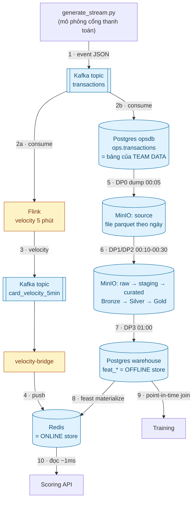

# Data Engineering cho dân ML — luồng dữ liệu hệ Fraud Detection

> **⚠️ Tài liệu này mô tả PHIÊN BẢN LUỒNG CŨ.** Nó vẫn hữu ích để học các khái niệm
> data engineering (medallion, SCD2, watermark, point-in-time, feature store) vì
> phần giảng giải không phụ thuộc phiên bản. Nhưng **đừng dùng nó làm tài liệu vận
> hành** — luồng đã được xây lại.
>
> Tài liệu đích hiện tại: **[`docs/data-pipeline.md`](data-pipeline.md)**.
>
> Những chỗ tài liệu này nói khác thực tế:
>
> | Ở đây | Hiện tại |
> |---|---|
> | Flink tính `card_velocity_5min` | Velocity 5 phút tính **đồng bộ** bằng Redis sorted set trong đường score. Flink chuyển sang merchant 10 phút + device 1 giờ (`realtime_features.sql`) |
> | Có bảng `feat_card_device` + `card_is_new_device_90d` | Đã bỏ. Tín hiệu "thiết bị lạ" giờ là `device_age_hours` + `device_burst` |
> | 3 DAG riêng `dp1` / `dp2` / `dp3` theo lịch giờ | Một DAG `ml_pipeline` với 3 TaskGroup **nối tiếp** (Airflow bảo đảm thứ tự) |
> | Reference data ghi thẳng MinIO | Nằm ở `ops.*` (Postgres), export ra MinIO bởi DP0 — một system of record duy nhất |
> | `dp3_velocity_backfill.py`, `velocity_bridge.py`, `velocity_5min.sql` | Đã xoá; thay bằng `feature_bridge.py` + `realtime_features.sql` |

Tài liệu này giải thích **toàn bộ đường đi của dữ liệu** trong hệ thống, viết cho
người quen ML nhưng chưa làm data engineering. Mọi khái niệm DE đều được định
nghĩa ngay lần đầu xuất hiện, kèm liên hệ với thứ tương đương bên ML.

---

## Mục lục

1. [Vì sao cần data engineering](#1-vì-sao-cần-data-engineering)
2. [Bức tranh tổng thể](#2-bức-tranh-tổng-thể)
3. [Các công cụ và vai trò](#3-các-công-cụ-và-vai-trò)
4. [Kiến trúc medallion: Bronze → Silver → Gold](#4-kiến-trúc-medallion-bronze--silver--gold)
5. [Luồng LIVE: giao dịch xảy ra ngay bây giờ](#5-luồng-live-giao-dịch-xảy-ra-ngay-bây-giờ)
6. [Luồng BATCH: 4 pipeline chạy hằng đêm](#6-luồng-batch-4-pipeline-chạy-hằng-đêm)
7. [Dữ liệu bẩn: 7 lỗi cố tình tiêm và cách xử lý](#7-dữ-liệu-bẩn-7-lỗi-cố-tình-tiêm-và-cách-xử-lý)
8. [Feature store: 3 tầng feature](#8-feature-store-3-tầng-feature)
9. [Chống data leakage: point-in-time và SCD2](#9-chống-data-leakage-point-in-time-và-scd2)
10. [16 bug thật đã gặp và bài học](#10-16-bug-thật-đã-gặp-và-bài-học)
11. [Bảng tra cứu nhanh](#11-bảng-tra-cứu-nhanh)

---

## 1. Vì sao cần data engineering

Khi làm ML bạn thường bắt đầu từ một file `training_data.parquet` có sẵn: load
lên, train, đánh giá. **Data engineering là toàn bộ phần việc trước đó** — cái
file ấy từ đâu ra, ai làm sạch nó, làm sao đảm bảo ngày mai nó vẫn đúng.

Ba câu hỏi mà DE phải trả lời, và ML không tự trả lời được:

| Câu hỏi | Vì sao ML không tự lo được |
|---|---|
| Dữ liệu thô nằm ở đâu, ai sở hữu? | Thường ở hệ thống của phòng ban khác, không cho query trực tiếp |
| Làm sao có feature **lúc serving** giống hệt lúc train? | Train đọc file, serving đọc API — hai đường khác nhau rất dễ lệch |
| Làm sao biết feature hôm nay không bị hỏng? | Cần validate tự động, không ai ngồi nhìn 300k dòng |

Câu thứ hai — **train/serve consistency** — là thứ giết nhiều mô hình nhất trong
thực tế: offline AUC đẹp, lên production sập, vì lúc serving feature được tính
khác đi một chút.

---

## 2. Bức tranh tổng thể

Hệ thống có **hai luồng chạy song song**, gặp nhau ở feature store:



**Luồng LIVE (1→4)**: giao dịch vừa xảy ra → Kafka → Flink tính velocity → Redis.
Mục đích: cho model chấm điểm **ngay lập tức**.

**Luồng BATCH (5→8)**: cuối ngày gom lại thành file → làm sạch → tính feature
lịch sử. Mục đích: có dữ liệu **sạch và đầy đủ** để train.

Hai luồng dùng **cùng một nguồn giao dịch** (topic Kafka) — đây là điểm thiết kế
quan trọng nhất, sẽ giải thích ở mục 5.

---

## 3. Các công cụ và vai trò

Đọc bảng này trước, phần sau sẽ dễ hơn nhiều.

| Công cụ | Nó là gì (nói đơn giản) | Tương đương bên ML |
|---|---|---|
| **Kafka / Redpanda** | Hàng đợi tin nhắn. Bên gửi ném message vào, bên nhận lấy ra; hai bên không cần biết nhau | `DataLoader` với buffer vô hạn, nhiều consumer đọc song song |
| **MinIO** | "Ổ cứng trên mạng", bản chạy local của Amazon S3. Lưu file | Thư mục chứa dataset, nhưng có versioning và truy cập qua network |
| **Parquet** | Định dạng file bảng, nén tốt, lưu theo cột | `.npy`/`.pt` của giới data — ai cũng đọc được |
| **Spark** | Engine xử lý **batch**: chia dữ liệu lớn cho nhiều máy làm song song | `DataParallel` nhưng cho bảng dữ liệu thay vì tensor |
| **Flink** | Engine xử lý **streaming**: tính toán trên dòng dữ liệu chảy liên tục | Online/incremental learning — xử lý từng mẫu khi nó tới |
| **Airflow** | Bộ lập lịch. Không xử lý dữ liệu, chỉ điều phối "chạy A xong thì chạy B" | `Makefile` + cron, có UI và retry |
| **Postgres** | Cơ sở dữ liệu quan hệ (SQL) | — |
| **Redis** | Kho key-value trong RAM, đọc cực nhanh (~1ms) | Cache/vector store cho lookup lúc inference |
| **Feast** | Feature store: quản lý định nghĩa feature, đảm bảo train và serve dùng chung | Không có tương đương trực tiếp — đây là thứ ML thường thiếu |
| **Docker Compose** | Chạy tất cả các thứ trên bằng 1 lệnh | `conda env` nhưng cho cả service |

Một điểm cần nhớ: **Feast không lưu dữ liệu**. Nó chỉ là lớp quản lý nằm trên
Postgres (offline) và Redis (online).

---

## 4. Kiến trúc medallion: Bronze → Silver → Gold

Ý tưởng: **dữ liệu thô rất bẩn, dọn dần qua từng tầng**, mỗi tầng sạch hơn tầng
trước. Tên gọi lấy từ huy chương đồng/bạc/vàng.

| Tầng | Bucket MinIO | Nội dung | Nguyên tắc |
|---|---|---|---|
| **Source** | `source` | File do "phòng ban khác" export | Không phải của mình, chỉ đọc |
| **Bronze** | `raw` | Copy nguyên xi từ source | **Không sửa gì**, bẩn giữ nguyên |
| **Silver** | `staging` | Đã dedup, đã thống nhất schema | Tin được về mặt kỹ thuật |
| **Gold** | `curated` | `fact_transactions` + `dim_*` | Sẵn sàng cho nghiệp vụ / ML |

### Vì sao Bronze phải giữ nguyên dữ liệu bẩn?

Đây là câu hỏi ai cũng hỏi. Lý do: **nếu code dọn dẹp có bug, bạn còn bản gốc để
chạy lại**. Giống như bạn giữ raw dataset trước khi preprocessing — nếu phát hiện
hàm normalize sai, bạn không phải đi xin lại dữ liệu.

### `fact` và `dim` ở tầng Gold

Ở Gold, dữ liệu được tách làm hai loại bảng (mô hình gọi là *star schema*):

- **`fact_transactions`** — bảng **sự kiện**. Mỗi dòng là một việc đã xảy ra
  (một giao dịch), có thời điểm, có số đo. Rất nhiều dòng, tăng liên tục.
- **`dim_user`, `dim_card`, `dim_merchant`, `dim_device`** — bảng **mô tả**.
  Thông tin về thực thể (khách tên gì, thẻ hãng nào). Ít dòng, đổi chậm.

Liên hệ ML: `fact` giống bảng training samples (mỗi dòng 1 event), `dim` giống
metadata/lookup table cho từng entity id.

### Quy ước đặt tên

| Prefix | Nghĩa | Ví dụ |
|---|---|---|
| `raw_` | dữ liệu thô ở Bronze | `raw/transactions` |
| `stg_` | staging, đã dọn | `staging/transactions` |
| `dim_` | bảng mô tả | `dim_user` |
| `fact_` | bảng sự kiện | `fact_transactions` |
| `feat_` | bảng feature cho model | `feat_card` |

---

## 5. Luồng LIVE: giao dịch xảy ra ngay bây giờ

### 5.1 Vấn đề thiết kế cốt lõi

Câu hỏi tưởng đơn giản: **giao dịch đi vào Kafka trước hay vào API chấm điểm
trước?**

Trong hệ banking thật: **API trước, đồng bộ**. Kafka **không nằm trong đường
quyết định** vì (a) authorization có timeout cứng ~2-3 giây, (b) Kafka chết thì
không được phép làm sập việc thanh toán, (c) đường auth vốn đã là request/response.

Kafka nhận **bản copy sau khi đã trả lời**, để phục vụ mọi thứ phía sau: lưu trữ,
model chạy nền, giám sát, data lake.

Trong dự án này, vì chưa có model nên ta tập trung vào phần data: producer bắn
thẳng vào Kafka, và Kafka là nguồn cho cả hai luồng.

### 5.2 Ba nhánh từ một topic

```
generate_stream.py ──► Kafka `transactions` ──┬──► Flink  (tính velocity)
                                              └──► ops-ingest (lưu vào bảng)
```

**Nhánh 1 — Flink tính velocity 5 phút.** Xem mục 5.3.

**Nhánh 2 — `ops-ingest` ghi vào `opsdb.ops.transactions`.** Đây là **bảng của
team data** (phòng ban vận hành). Vì sao cần bảng này thay vì đọc thẳng Kafka
lúc cuối ngày?

- **Kafka không phải kho lưu trữ.** Retention thường vài giờ/ngày. Dựng file ngày
  bằng cách replay topic nghĩa là tính đúng đắn của batch phụ thuộc vào retention.
- **Bảng thì query lại được.** `SELECT ... WHERE created_at BETWEEN ...` chạy lại
  bao nhiêu lần cũng ra kết quả y hệt (idempotent).

Bảng này **cố ý không có primary key**. Kafka giao hàng *at-least-once* nên
duplicate là chuyện bình thường; nếu đặt PK thì Postgres chặn hết và ta mất luôn
phần "duplicate" cần demo. File: [sql/01_ops_schema.sql](../data_pipelines/sql/01_ops_schema.sql).

### 5.3 Flink tính velocity — giải thích chi tiết

**Velocity** = tốc độ giao dịch. Ví dụ "thẻ này quẹt bao nhiêu lần trong 5 phút
vừa rồi". Đây là feature vàng của fraud: quẹt 37 lần trong 5 phút với số tiền
$3.40/lần = **card testing** (kẻ gian test xem thẻ ăn cắp còn sống không).

File [velocity_5min.sql](../data_pipelines/flink/sql/velocity_5min.sql) làm 3 việc:

**a) Khai báo nguồn — `CREATE TABLE` ở đây KHÔNG tạo bảng nào cả**

```sql
CREATE TABLE transactions_src (...) WITH (
  'connector' = 'kafka',
  'topic'     = 'transactions', ...
);
```

Nó chỉ là **nhãn dán metadata**: "ngoài kia có topic Kafka tên này, schema thế
này". Không byte dữ liệu nào lưu trong Flink. Flink gọi là **dynamic table** —
bảng mà nội dung thay đổi liên tục.

Ý tưởng nền là **stream-table duality**: một stream và một bảng là hai cách nhìn
cùng một thứ. Nhờ vậy bạn viết được SQL bình thường trên dữ liệu vô hạn.

**b) Watermark — xử lý hàng về muộn**

```sql
WATERMARK FOR created_at AS created_at - INTERVAL '90' SECOND
```

Dữ liệu streaming không tới theo thứ tự: giao dịch lúc 10:04 có thể tới lúc
10:05 vì mạng chậm. Nếu cửa sổ 10:00–10:05 chốt sổ đúng 10:05 thì mất giao dịch đó.

**Watermark** là lời hứa của Flink: *"tôi chờ thêm 90 giây cho hàng về muộn rồi
mới chốt"*. Đây là **đánh đổi trực tiếp**:

| Watermark | Bắt được hàng muộn | Feature ra nhanh |
|---|---|---|
| 30 phút | tốt | **vô dụng** — velocity ra sau 30 phút thì fraud trôi mất rồi |
| 90 giây | đủ (producer trễ tối đa 60s) | chấp nhận được |
| 5 giây | mất nhiều | nhanh |

Ban đầu mình để 30 phút và window **không bao giờ chốt kịp để dùng** — phải hạ
xuống 90 giây. Đây là bài học thật, không phải lý thuyết.

**c) Window — cắt dòng vô hạn thành từng khúc**

```sql
FROM TABLE(HOP(TABLE tx_dedup, DESCRIPTOR(created_at),
    INTERVAL '1' MINUTE,    -- slide: cứ 1 phút tạo 1 cửa sổ mới
    INTERVAL '5' MINUTE))   -- size : mỗi cửa sổ dài 5 phút
```

`HOP` = sliding window, các cửa sổ **chồng lấn nhau**:

```
[10:00 ─── 10:05)
   [10:01 ─── 10:06)
      [10:02 ─── 10:07)
```

Một giao dịch được đếm trong 5 cửa sổ liên tiếp. Nhờ vậy feature cập nhật mỗi
phút thay vì mỗi 5 phút.

### 5.4 Điểm yếu của cách tính này (quan trọng)

Cách Flink tính velocity **không giống hệ banking thật**, và có 2 hệ quả:

**Hệ quả 1 — trễ ~2.5 phút.** Window chốt sau `slide (1') + watermark (90s)`.
Nên burst vừa bắt đầu thì Redis chưa biết.

**Hệ quả 2 — không bao giờ có số 0.** Window rỗng thì Flink **không emit gì cả**
(không có dữ liệu → không có nhóm → không có dòng). Nên khi thẻ ngừng giao dịch,
giá trị cuối cùng **đóng băng** trong Redis.

Đo được thật: thẻ burst lúc 15:35 với `count=37`; đến **15:58** Redis vẫn trả 37
dù thẻ đã im 23 phút.

**Cách chữa đã áp dụng**: đẩy kèm `velocity_ts_epoch` (mốc thời gian của giá trị),
rồi ODFV so với thời điểm giao dịch — quá 5 phút thì trả 0. Chi tiết ở mục 8.

**Cách hệ banking thật làm**: cập nhật counter **đồng bộ ngay trong lời gọi
score** (`READ profile → tính → score → WRITE profile`), nên velocity chính xác
tuyệt đối, lag = 0. Ví dụ với Redis sorted set:

```python
p.zadd(f"vel:{card_id}", {txn_id: ts})
p.zremrangebyscore(f"vel:{card_id}", 0, ts - 300)   # bỏ ngoài cửa sổ
p.zcount(f"vel:{card_id}", ts - 300, ts)            # velocity chính xác
```

Vì sao counter **phải** update đồng bộ chứ không qua Kafka: card testing là 12–45
giao dịch trong vài giây. Nếu counter cập nhật qua Kafka (trễ vài trăm ms), mỗi
giao dịch đều "không thấy" các giao dịch trước → bỏ lọt đúng loại tấn công mà
velocity sinh ra để bắt.

---

## 6. Luồng BATCH: 4 pipeline chạy hằng đêm

Bốn DAG Airflow chạy nối tiếp, mỗi cái xử lý **ngày hôm trước**:

| Giờ | DAG | Việc |
|---|---|---|
| **00:05** | `dp0_export_source` | Dump `ops.transactions` của ngày → file parquet ở `source` |
| **00:10** | `dp1_ingest_bronze` | Copy file `source` → `raw` (Bronze), không sửa gì |
| **00:30** | `dp2_transform` | Spark: Bronze → Silver → Gold (dedup, mergeSchema, SCD2, fact) |
| **01:00** | `dp3_features` | Spark: Gold → bảng `feat_*` ở Postgres, rồi materialize sang Redis |

### Vì sao dump lúc 00:05 chứ không 23:50?

Ban đầu định 23:50 (trước nửa đêm) cho pipeline có data sẵn. Nhưng dump lúc 23:50
chỉ phủ được `[00:00, 23:50)` → **10 phút cuối ngày không bao giờ được export**,
hôm sau cũng không phủ. Mỗi ngày mất 10 phút dữ liệu.

Chuyển sang 00:05 phủ **trọn ngày hôm trước**, DP1 vẫn 00:10 — vừa đủ, không thủng.

### Cách xác định "ngày cần xử lý"

Chi tiết nhỏ nhưng từng gây bug. Airflow có 2 khái niệm:
- `logical_date` — thời điểm lịch trình của lần chạy
- `data_interval_start` — đầu khoảng thời gian mà lần chạy này phụ trách

Cách "chuẩn Airflow" là dùng `data_interval_start`. Nhưng **manual run và
`airflow tasks test` gán interval = chính thời điểm chạy**, không lùi 1 kỳ như
scheduled run. Nghĩa là chạy tay sẽ ra sai ngày.

Nên tất cả DAG dùng `logical_date - 1 ngày`, nhất quán ở mọi kiểu chạy:

```python
DS_HCM = '{{ (logical_date - macros.timedelta(days=1))
             .in_timezone("Asia/Ho_Chi_Minh").strftime("%Y-%m-%d") }}'
```

### DP2 làm gì cụ thể

**Bronze → Silver** ([dp2_bronze_to_silver.py](../data_pipelines/spark/jobs/dp2_bronze_to_silver.py)):
- `mergeSchema` — hợp nhất schema giữa các partition (partition cũ thiếu cột thì điền null)
- `dropDuplicates(["id"])` — khử trùng lặp

**Silver → Gold** ([dp2_silver_to_gold.py](../data_pipelines/spark/jobs/dp2_silver_to_gold.py)):
- `--stage fact` — ghi `fact_transactions` partition theo ngày
- `--stage dims` — dựng `dim_*` theo **SCD Type 2** (mục 9)

### DP3 làm gì

[dp3_gold_to_features.py](../data_pipelines/spark/jobs/dp3_gold_to_features.py) tính 5 bảng
feature, mỗi entity một bảng:

| Bảng | Khoá | Feature |
|---|---|---|
| `feat_card` | card_id | tx_count/sum/avg 90 ngày + thuộc tính thẻ |
| `feat_user` | user_id | user_device_count_30d + thuộc tính khách |
| `feat_merchant` | merchant_id | category, risk_level |
| `feat_device` | device_id | **device_distinct_users_30d** |
| `feat_card_device` | (card_id, device_id) | các cặp đã thấy trong 90 ngày |

**Vì sao 5 bảng mà không gộp 1?** Vì **khoá chính khác nhau**. Một dòng khoá theo
`card_id` không có `device_id` duy nhất để điền. Gộp lại sẽ ra bảng đầy null.

Nhưng lúc **train** thì Feast tự ghép 5 bảng này thành **một bảng phẳng** qua
point-in-time join — bạn không phải maintain bảng phẳng bằng tay.

**`device_distinct_users_30d` là feature quan trọng nhất mà nhiều người bỏ sót.**
Nó đếm *một thiết bị bị bao nhiêu user khác nhau dùng*. Đây là cách duy nhất bắt
được **fraud ring** (băng nhóm dùng chung một device farm). Chú ý chiều: đếm từ
phía **device**, không phải phía user — vì mỗi nạn nhân chỉ bị chạm 1–2 lần nên
nhìn từ phía user hoàn toàn bình thường.

---

## 7. Dữ liệu bẩn: 7 lỗi cố tình tiêm và cách xử lý

Dữ liệu thật luôn bẩn. Ta cố tình tiêm lỗi để chứng minh pipeline xử lý được.

### 4 lỗi offline (trong file batch)

| Lỗi | Tiêm thế nào | Xử lý ở đâu | Số đo thật |
|---|---|---|---|
| **Duplicate** | Producer gửi lại y hệt 1.5% message | DP2 `dropDuplicates` | 10.013 → 9.856 (157 dòng) |
| **Skew** | 80% user ở US → 80% giao dịch ở US | Spark salting / AQE | US = 79.8% |
| **High cardinality** | `device_id`/`card_id` hàng chục nghìn giá trị | tránh shuffle theo key đó | device 26.059, card 25.100 distinct |
| **Schema evolution** | Cột `auth_3ds_flag` chỉ có từ 2026-05-01 | `mergeSchema` | 282 partition cũ thiếu / 83 mới có |

**Skew là gì và vì sao hại?** Spark chia dữ liệu cho nhiều worker. Khi group-by
theo `billing_country_code` mà 80% là US, **một worker ôm 80% việc, số còn lại
ngồi chơi** — giống một GPU nghẽn còn cả cụm idle. Cách chữa: *salting* (thêm số
ngẫu nhiên vào key để bẻ "US" thành 10 mảnh nhỏ).

**Schema evolution là gì?** Hệ nguồn thêm cột mới vào một thời điểm. Dữ liệu
trước đó không có cột này. Nếu đọc gộp kiểu ngây thơ, engine lấy schema của file
đầu tiên → **mất luôn cột mới**. Đã kiểm chứng: đọc thường không thấy
`auth_3ds_flag`; đọc có `mergeSchema` thì thấy, null 100% ở data cũ / 0% ở data mới.

### 3 lỗi streaming

| Lỗi | Tiêm thế nào | Xử lý ở đâu | Số đo thật |
|---|---|---|---|
| **Burst** | Cứ 30s thì tăng rate ×10 trong 5s | Flink backpressure + parallelism | 6.581/10.013 message trong burst |
| **Late arrival** | 5% message có event-time lùi 5–60s | `WATERMARK ... - 90 SECOND` | 4.7% |
| **Duplicate** | 1.5% message gửi lại | `ROW_NUMBER() OVER (PARTITION BY id) = 1` | 1.6% |

---

## 8. Feature store: 3 tầng feature

Đây là phần liên quan trực tiếp nhất tới ML.

### Vì sao phải tách batch và streaming?

Feature fraud có **hai chất thông tin khác hẳn nhau**:

| | Nhìn sâu quá khứ | Phản ứng tức thì |
|---|---|---|
| Ví dụ | "tổng chi tiêu 90 ngày" | "số giao dịch 5 phút vừa rồi" |
| Cần gì | quét cả núi lịch sử | độ tươi tuyệt đối |
| Engine | **Spark** (batch) | **Flink** (streaming) |

Không thể đổi vai: bắt Spark tính velocity 5 phút thì nó chạy 6 tiếng/lần → số
liệu 6 tiếng trước, vô dụng. Bắt Flink giữ 90 ngày dữ liệu của mọi khách trong
bộ nhớ thì tốn RAM khủng khiếp.

Liên hệ ML: batch feature giống **user embedding** train offline (đổi chậm, tính
nặng, cache lại); streaming feature giống **session context** trong request hiện
tại (phải tươi tuyệt đối).

### Ba tầng

| Tầng | Ai tính | Lưu ở đâu | Ví dụ |
|---|---|---|---|
| **Batch** | Spark DP3, hằng ngày | Postgres → materialize → Redis | `card_tx_count_90d`, `device_distinct_users_30d`, thuộc tính dim |
| **Streaming** | Flink, liên tục | push thẳng vào Redis | `card_tx_count_5min` |
| **On-demand** | tính ngay lúc score | **không lưu đâu cả** | `log_amount`, `hour`, `geo_mismatch` |

**On-demand là gì và vì sao không lưu?** Những feature chỉ phụ thuộc vào chính
giao dịch đang tới: `log_amount = log(amount)`, `geo_mismatch = (billing ≠ ip)`.
Lúc chấm điểm bạn đã cầm giao dịch trong tay rồi. Lưu trước là vô nghĩa — giao
dịch còn chưa xảy ra thì lưu `hour` của nó vào đâu?

### OnDemandFeatureView — chìa khoá chống train/serve skew

Feast cho phép viết phép biến đổi **một lần**, chạy **giống hệt** ở cả hai phía:

```python
@on_demand_feature_view(sources=[txn_request, card_features, ...], schema=[...])
def txn_on_demand(inp):
    out["log_amount"]   = np.log1p(inp["amount_usd"])
    out["geo_mismatch"] = (inp["billing_country_code"] != inp["ip_country_code"]).astype("int64")
    ...
```

Vì cùng một hàm chạy lúc train (trên dòng lịch sử) lẫn lúc serve (trên request),
**không thể lệch định nghĩa**. Không còn cảnh SQL tính log kiểu này, Python
serving tính kiểu khác.

ODFV còn giải quyết 2 việc khéo:

**a) `card_is_new_device_90d`** — không lưu boolean, mà lưu bảng các cặp
`(card_id, device_id)` đã thấy. Lúc score, **tra không thấy key = thiết bị mới**:
```python
out["card_is_new_device_90d"] = inp["cd_tx_count_90d"].isna()
```

**b) Kiểm tra độ tươi của velocity** — chữa đúng cái bug "đóng băng ở 37":
```python
age = inp["event_ts_epoch"] - inp["velocity_ts_epoch"]
fresh = (age >= -60) & (age <= 300)
out["card_tx_count_5min"] = np.where(fresh, inp["raw_card_tx_count_5min"], 0)
```

**Vì sao ngưỡng đúng 5 phút?**
- **Sàn**: giá trị tới Redis đã già ~90–150s (watermark 90s + slide 1' + bridge).
  Ngưỡng nhỏ hơn ~2.5 phút thì mọi giá trị hết hạn ngay khi vừa đến → feature vô dụng.
- **Trần**: ngưỡng càng lớn thì giá trị đóng băng sống càng lâu → càng lâu trả số sai.
- → 5 phút = đúng kích thước window, chừa ~2 phút biên trên sàn.

Kiểm chứng: cùng một thẻ, giao dịch trong 5 phút → trả 147; sau 6m40s → trả 0.

### Một hợp đồng duy nhất: FeatureService

```python
fraud_detection_service = FeatureService(name="fraud_detection_service", features=[
    card_features, user_features, merchant_features, device_features,
    card_device_features, card_velocity_features, txn_on_demand,
])
```

Train gọi `get_historical_features(service)`, serve gọi
`get_online_features(service)` — **cùng một service** nên cùng tên, cùng thứ tự,
cùng định nghĩa.

---

## 9. Chống data leakage: point-in-time và SCD2

Phần này dân ML sẽ thấy quen.

### SCD Type 2 — lưu lịch sử thay vì ghi đè

Bảng `dim_user` có 3 cột đặc biệt: `valid_from_ts`, `valid_to_ts`, `is_current`.

Khi khách chuyển từ US sang ZZ, ta **không sửa đè** mà **thêm dòng mới**:

| country | valid_from | valid_to | is_current |
|---|---|---|---|
| US | 08:31:02 | 08:31:20 | **False** ← bản cũ, đã đóng |
| ZZ | 08:31:20 | (null) | **True** ← bản hiện tại |

**Vì sao quan trọng với ML?** Khi train trên giao dịch tháng 1, bạn cần biết
*lúc đó* khách ở đâu (US), không phải bây giờ (ZZ). Nếu join với snapshot hiện
tại, bạn vừa **nhét thông tin tương lai vào feature** — data leakage kinh điển:
offline đẹp, production sập.

- `is_current = true` → dùng khi **serving** (cần trạng thái mới nhất)
- `valid_from/valid_to` → dùng khi **training** (join as-of đúng thời điểm)

### Point-in-time join

Bảng `feat_*` có 2 cột bắt buộc: `event_timestamp` (giá trị này có hiệu lực từ
lúc nào) và `created` (lúc tính). Khi train:

```python
entity_df = [{"card_id": ..., "event_timestamp": <thời điểm giao dịch>, "label": 1}]
store.get_historical_features(entity_df=entity_df, features=svc)
```

Với mỗi dòng, Feast lấy giá trị feature **hợp lệ tại-hoặc-trước** timestamp đó.
Không bao giờ lấy giá trị tương lai.

Đây cũng là lý do [dp3_velocity_backfill.py](../data_pipelines/spark/jobs/dp3_velocity_backfill.py)
tồn tại: Flink chỉ đẩy velocity vào online store (cho serving), nên offline store
không có lịch sử velocity → **train không dùng được nhóm feature 5 phút**. Job này
tái dựng đúng feature đó trên dữ liệu batch:

```python
w = Window.partitionBy("card_id").orderBy("ts_sec").rangeBetween(-300, 0)
df.withColumn("raw_card_tx_count_5min", F.count("*").over(w))
```

1 dòng/giao dịch với `event_timestamp = created_at` → point-in-time join lấy đúng
velocity **tại thời điểm** giao dịch đó, khớp với cái Flink thấy lúc serving.

---

## 10. 16 bug thật đã gặp và bài học

Phần này giá trị nhất — đây là những thứ tài liệu không dạy.

### Nhóm A — kiểu dữ liệu và schema

**1. Timestamp nanosecond.** Pandas mặc định `datetime64[ns]` → parquet lưu
nanos → **Spark 3.5 không đọc được** (`Illegal Parquet type: TIMESTAMP(NANOS)`).
→ Luôn ghi `coerce_timestamps="us"`.

**2. Cột toàn NULL thành type `null`.** Producer quên gửi `auth_3ds_flag` → cả
cột NULL → pyarrow suy ra type `null` → Spark `mergeSchema` fail
(`CANNOT_MERGE_INCOMPATIBLE_DATA_TYPE: BOOLEAN và INT`).
→ Ép `astype("boolean")` để cột all-null vẫn ra đúng type.

**3. Marker thư mục rỗng.** `delete_dir_contents` để lại marker → code tưởng
path còn data → đọc parquet rỗng → `UNABLE_TO_INFER_SCHEMA`.
→ Kiểm tra "có file thật" chứ không chỉ "path tồn tại".

### Nhóm B — Spark

**4. Đọc và ghi đè cùng một path.** Spark lazy nên nó **xoá nguồn trước khi đọc
xong** → `FileNotFoundException`. Xảy ra ở SCD2 merge (đọc `dim_user`, ghi đè
`dim_user`).
→ Ghi ra temp path rồi swap.

**5. JDBC classloader.** Jar nạp qua `--packages` nằm trong *user classloader*,
còn `java.sql.DriverManager` ở *system classloader* → `No suitable driver found`.
→ Load class driver bằng context classloader rồi gọi `driver.connect()` trực tiếp.
(Và `getDeclaredConstructor()` py4j không expose → dùng `newInstance()`.)

### Nhóm C — Airflow

**6. `Variable.get(default_var=...)`.** Airflow 3 đổi thành `default=`.

**7. `data_interval_start` không nhất quán.** Scheduled run thì nó lùi 1 kỳ,
nhưng **manual run và `tasks test` gán = chính thời điểm chạy**.
→ Dùng `logical_date - 1 ngày`, đúng ở mọi kiểu chạy.

**8. `ds` render theo UTC.** DAG timezone là +07 nhưng `ds` là UTC → lệch ngày.
→ `.in_timezone("Asia/Ho_Chi_Minh")`.

### Nhóm D — Flink

**9. Idle partition làm watermark kẹt.** Watermark toàn cục = **MIN** của mọi
subtask. Một partition Kafka không có message → subtask đó giữ watermark thấp →
**window không bao giờ đóng, output = 0**. Triệu chứng đánh lừa: source đọc được
5.366 record mà không ra gì.
→ `SET 'table.exec.source.idle-timeout' = '10s'`.

**10. Không có checkpointing.** Restart là mất sạch state (window buffer + dedup)
và mất vị trí offset.
→ Bật checkpoint 10s + `RETAIN_ON_CANCELLATION` + restart-strategy.
Đo được: 8 checkpoint, 0 fail, state 926 KB, 12 ms/lần.

**11. `latest-offset` làm mất dữ liệu.** Job restart thì bỏ qua toàn bộ message
đến trong lúc nó chết.
→ `group-offsets` + `auto.offset.reset=earliest`.

**12. Volume checkpoint sai quyền.** JVM Flink chạy bằng uid 9999 nhưng volume
do root sở hữu → job fail ngay khi bật checkpointing.
→ Thêm init container chown. **Bài học phụ**: `docker exec` cho bạn root nên test
quyền bằng nó là **âm tính giả** — phải test bằng `-u flink`.

### Nhóm E — Feast

**13. `materialize-incremental` bỏ qua bản cập nhật.** Nó chỉ lấy row có
`event_timestamp` **mới hơn** mốc lần trước. DP3 ghi `event_timestamp = ngày
00:00`, nên chạy lại cùng ngày → bị bỏ qua. Triệu chứng: Postgres có
`card_tx_count_90d=148` mà Redis vẫn trả **0**.
→ Dùng `feast materialize <range>` tường minh.

**14. Materialize ghi đè giá trị real-time.** `card_velocity_features` có cả
`batch_source` (để train) lẫn push source (real-time). Materialize lấy giá trị
backfill đè lên giá trị Flink vừa push.
→ `--views` chỉ liệt kê 5 view batch, loại velocity ra.

**15. Redis chỉ ghi nếu timestamp mới hơn.** Khi sửa lỗi timestamp, bản đúng bị
coi là "cũ hơn" bản sai → bỏ qua.
→ Phải `FLUSHALL` rồi nạp lại. Rất dễ mất thời gian debug nếu không biết.

**16. `FeatureView.ttl` không filter online read.** Nó chỉ tác dụng ở historical
retrieval. Redis store chỉ có `key_ttl_seconds` cấp store (áp cho mọi view → giết
feature batch).
→ Phải tự kiểm tra độ tươi trong ODFV.

### Nhóm F — logic nghiệp vụ

**17. Duplicate giả 39%.** Producer lặp pool (`tx_rows[i % len]`) và phát lại
**cùng id**; pool sizing tính theo rate nền nhưng burst ×10 đốt pool nhanh hơn.
→ Cấp `id` mới mỗi lần phát; chỉ duplicate cố ý mới trùng id. Về đúng 1.6%.

**18. Append không idempotent.** Chạy lại DP3 cho cùng một ngày → nhân đôi dòng
→ point-in-time join gặp nhiều bản cùng timestamp.
→ Delete-then-append. Kiểm chứng: chạy 2 lần, tổng vẫn 83.521.

**19. Phân phối thời gian dốc đuôi.** Generator gốc dồn 50% giao dịch vào 30 ngày
cuối → với cửa sổ 1 năm thì ngày cuối có 23k giao dịch còn median chỉ 64.
→ Phân bố đều + sinh entity trước `start_date`. Kết quả: mean 830, median 831,
min 746, max 920.

---

## 11. Bảng tra cứu nhanh

### Cổng và UI

| Service | URL |
|---|---|
| MinIO Console | http://localhost:9001 |
| Airflow | http://localhost:8090 |
| Spark Master UI | http://localhost:8080 |
| Spark Worker UI | http://localhost:8083 |
| Flink Dashboard | http://localhost:8082 |
| Redpanda Console | http://localhost:8085 |
| Postgres | localhost:5432 |
| Redis | localhost:6380 |

### Kho dữ liệu

| Nơi | Nội dung |
|---|---|
| MinIO `source` | file parquet do team data export |
| MinIO `raw` / `staging` / `curated` | Bronze / Silver / Gold |
| Postgres `opsdb.ops.transactions` | bảng vận hành của team data |
| Postgres `warehouse.application.feat_*` | offline feature store |
| Postgres `feast-registry` | registry của Feast (12 bảng, tách riêng để không làm bẩn warehouse) |
| Redis | online feature store |
| Kafka `transactions` / `card_velocity_5min` | stream vào / velocity ra |

### Lệnh hay dùng

```bash
# dựng toàn bộ
cd data_pipelines && docker compose up -d

# sinh lịch sử 1 năm
uv run python data_pipelines/generator/generate_offline.py

# bắn stream (luồng live)
uv run python data_pipelines/generator/generate_stream.py --duration 200

# submit Flink job
docker exec flink-jobmanager /opt/flink/bin/sql-client.sh -f /opt/flink/sql/velocity_5min.sql

# chạy 1 task Airflow thủ công
docker exec <airflow-scheduler> airflow tasks test dp2_transform bronze_to_silver "2026-07-28T00:30:00+07:00"

# đọc feature từ online store
docker exec -w /opt/airflow/feature_store <airflow-scheduler> python check_online.py
```

### Số liệu của lần chạy đầy đủ gần nhất

| Chỉ số | Giá trị |
|---|---|
| Lịch sử | 366 partition, 27/07/2025 → 27/07/2026 |
| Source / Bronze | 312.926 dòng |
| Silver / Gold | 309.770 dòng (dedup sạch: unique = tổng) |
| Stream 1 lượt | 10.013 message, late 4.7%, duplicate 1.6% |
| Feature offline | card 27.494 · user 25.000 · merchant 1.500 · device 30.000 · card_device 33.290 · velocity 83.521 |
| Redis | 117.485 key |
| Flink checkpoint | 926 KB, 12 ms |

---

## Còn thiếu gì (trung thực)

- **Chưa train model** — pipeline data đã xong nhưng chưa có model tiêu thụ feature.
- **DataHub / lineage** — chưa dựng.
- **Tối ưu storage** (compaction, z-order, indexing) — chưa làm.
- **Nhãn có độ trễ** — MVP giả định label tức thời; thực tế chargeback về sau
  30–120 ngày, cần "label maturity cutoff" khi train.
- **Lịch chạy dựa trên thời gian** chứ chưa phải dependency thật. Nếu DP2 chạy quá
  30 phút thì DP3 khởi động khi DP2 chưa xong. Airflow 3 có **Assets**
  (dataset-driven scheduling) để chặt chẽ hơn.
