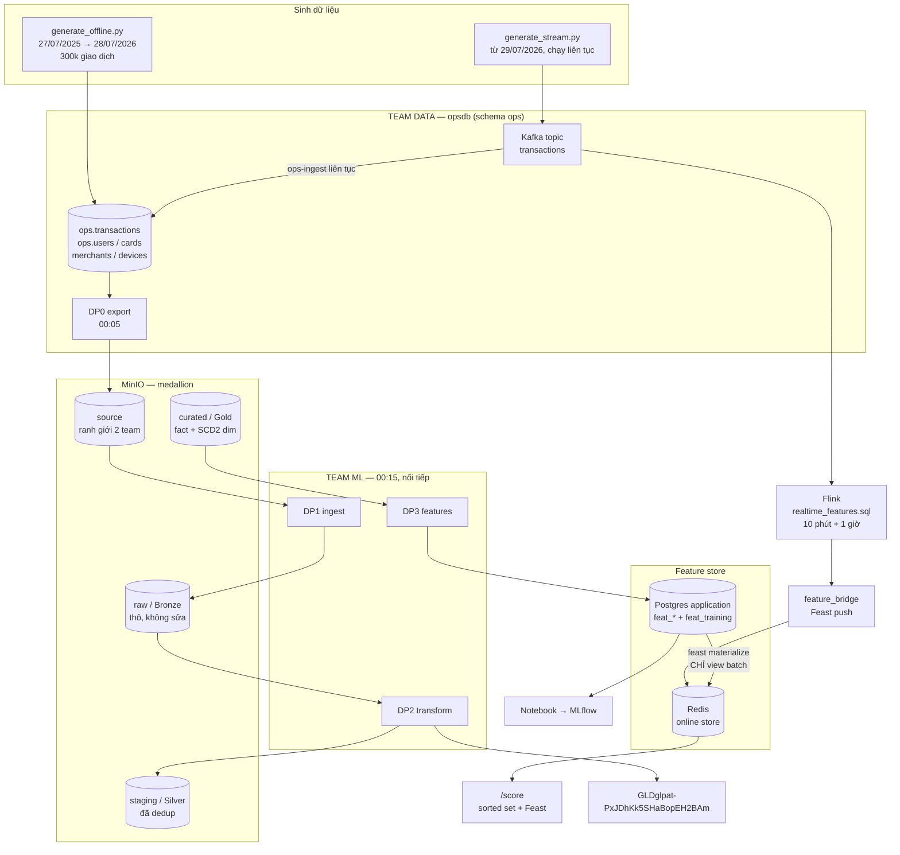

# Luồng dữ liệu fraud detection — tài liệu vận hành

Tài liệu **đích** cho luồng data. Mọi câu hỏi "cái này tính ở đâu", "ai ghi Redis",
"vì sao train và serve khớp nhau" đều trả lời được từ đây.

Viết cho người làm ML: mỗi khái niệm data engineering đều giải thích lại bằng ngôn
ngữ thường, và mọi quyết định đều kèm **vì sao** — vì phần lớn chúng là hệ quả của
một bug đã trả giá thật.

> Thay thế `docs/Data Engineering cho dan ML.md` (viết cho phiên bản luồng cũ, khi
> velocity còn tính bằng Flink và còn bảng `feat_card_device`).

---

## 1. Toàn cảnh

Hệ có **hai giai đoạn** dùng chung một đích:



Điểm quan trọng nhất của sơ đồ này: **`ops.transactions` là system of record duy
nhất.** Lịch sử và luồng live đều đi qua nó. Nhờ vậy batch và streaming tính trên
cùng một tập giao dịch — không thể phân kỳ.

Nếu generator ghi thẳng parquet lên MinIO (như phiên bản trước) thì có hai nguồn sự
thật, và sớm muộn Flink với Spark sẽ tính trên hai tập dữ liệu khác nhau mà không ai
phát hiện.

---

## 2. Bản đồ file

| Việc | File |
|---|---|
| **Hằng số cửa sổ + luật materialize** | `data_pipelines/shared/feature_windows.py` |
| DDL bảng team data | `data_pipelines/sql/ops/*.sql` |
| DDL labels + placeholder rt | `data_pipelines/sql/warehouse/*.sql` |
| Logic fraud archetype | `scripts/initial/generate_fake_data.py` |
| Nạp lịch sử | `data_pipelines/generator/generate_offline.py` |
| Luồng live → Kafka | `data_pipelines/generator/generate_stream.py` |
| Đọc/ghi `ops.*` | `data_pipelines/generator/ops_store.py` |
| Kafka → `ops.transactions` | `data_pipelines/airflow/include/kafka_to_ops.py` |
| DP0 export | `data_pipelines/airflow/include/ops_to_source.py` |
| DP1 copy MinIO | `data_pipelines/airflow/include/minio_io.py` |
| Bronze → Silver | `data_pipelines/spark/jobs/dp2_bronze_to_silver.py` |
| Silver → Gold (fact + SCD2) | `data_pipelines/spark/jobs/dp2_silver_to_gold.py` |
| Feature serving (4 bảng) | `data_pipelines/spark/jobs/dp3_gold_to_features.py` |
| Feature training (PIT) | `data_pipelines/spark/jobs/dp3_training_features.py` |
| Flink window processing | `data_pipelines/flink/sql/realtime_features.sql` |
| Flink → Redis | `data_pipelines/airflow/include/feature_bridge.py` |
| Hợp đồng feature | `feature_store/feature_views.py`, `feature_services.py` |
| Velocity đồng bộ | `src/fraud_detection/features/velocity.py` |
| Test chống lệch định nghĩa | `tests/test_velocity_parity.py` |
| DAG team data | `data_pipelines/airflow/dags/dp0_export_source.py` |
| DAG team ML | `data_pipelines/airflow/dags/ml_pipeline.py` |

---

## 3. Ba tầng feature

Đây là quyết định kiến trúc trung tâm. Tiêu chí phân vai **không phải** "window dài
thì dùng Flink" mà là **tốc độ thay đổi của tín hiệu so với độ trễ của công cụ**.

Flink có độ trễ cố hữu `slide + watermark` ≈ 2,5 phút (window chỉ phát ra sau khi
watermark vượt `window_end`).

| Tín hiệu | Thay đổi nhanh cỡ nào | Mất 2,5 phút cuối nghĩa là |
|---|---|---|
| `card_tx_count_5min` | 1 → 20 trong 90 giây | **mất cả sự kiện** (đo được: đúng 8, Flink trả 4) |
| `merch_distinct_cards_10min` | 150 → 180 trong 2,5 phút | model không quan tâm |
| `device_distinct_users_1h` | 8 → 9 | không đáng kể |

Card burst là **sự kiện tức thời**. Merchant bị lạm dụng là **trạng thái kéo dài
20+ phút**. Trễ 2,5 phút giết cái thứ nhất, không ảnh hưởng cái thứ hai.

| | Tính bởi (train) | Tính bởi (serve) | Vào Redis bằng |
|---|---|---|---|
| **Batch** 7d/30d/90d | Spark → `feat_training` | Spark → `feat_*` | `feast materialize` |
| **Flink** 10 phút / 1 giờ | Spark → `feat_training` | Flink | `feature_bridge` push |
| **Đồng bộ** 5 phút | Spark → `feat_training` | code API, Redis sorted set | không qua Redis-của-Feast |
| **On-demand** tỉ lệ, tuổi | ODFV (cùng một hàm Python) | ODFV | không lưu |

Đọc theo cột 2: **Spark tính TẤT CẢ cho offline.** Đọc theo cột 4: **mỗi nhóm có
đúng một người ghi online.** Hai câu đó là toàn bộ mô hình.

### Nguyên tắc: bảng batch chỉ chứa baseline, ODFV tính tỉ lệ

`amount_usd = 500` chẳng nói gì. `500` trên một thẻ có `card_amount_avg_90d = 12`
thì nói rất nhiều.

Với ngôn ngữ ML: chuẩn hoá **per-entity** thay vì chuẩn hoá toàn cục. Bảng batch
cung cấp `avg` / `max` / `std` / `last_seen`; ODFV chia ra lúc request. Nhờ vậy công
thức tỉ lệ chỉ tồn tại một chỗ và chạy y hệt ở train lẫn serve.

### Danh sách feature đầy đủ

**`feat_card`** (entity `card`) — dim: `card_brand`, `card_type`, `is_virtual`,
`card_created_at`; baseline 90d: `card_tx_count_90d`, `card_amount_sum_90d`,
`card_amount_avg_90d`, `card_amount_max_90d`, `card_amount_std_90d`,
`card_distinct_merchant_90d`; nhịp: `card_tx_count_7d`, `card_last_tx_at`.

**`feat_user`** (entity `user`) — dim: `customer_segment`, `kyc_level`,
`email_verified`, `user_country`, `account_created_at`; 30d: `user_tx_count_30d`,
`user_amount_avg_30d`, `user_device_count_30d`, `user_distinct_country_30d`,
`user_last_tx_at`.

**`feat_merchant`** (entity `merchant`) — dim: `merchant_category`,
`merchant_risk_level`; 30d: `merchant_tx_count_30d`, `merchant_amount_avg_30d`,
`merchant_amount_std_30d`, `merchant_distinct_cards_30d`.

**`feat_device`** (entity `device`) — `device_tx_count_30d`,
`device_distinct_users_30d`, `device_distinct_cards_30d`, `device_first_seen_at`.

**Flink** — `merch_tx_count_10min`, `merch_distinct_cards_10min`,
`merch_amount_avg_10min`, `device_tx_count_1h`, `device_distinct_users_1h`,
`device_distinct_cards_1h`.

**Đồng bộ** — `card_tx_count_5min`, `card_amount_sum_5min`, `card_amount_avg_5min`.

**ODFV** (`txn_on_demand`) — 29 feature, gồm:

| Nhóm | Feature |
|---|---|
| Thời gian | `log_amount`, `hour`, `weekday`, `is_night` |
| Địa lý / danh tính | `geo_mismatch`, `foreign_ip`, `recipient_differs` |
| Tuổi entity | `account_age_days`, `card_age_days`, `device_age_hours` |
| Số tiền vs baseline | `amount_vs_card_avg`, `amount_vs_card_max`, `amount_z_vs_card`, `amount_vs_user_avg`, `amount_z_vs_merchant` |
| Nhịp độ / ngủ đông | `card_acceleration`, `hours_since_last_card_tx`, `hours_since_last_user_tx` |
| Rủi ro merchant | `merchant_spread`, `merchant_burst` |
| Fraud ring | `device_burst`, `device_cards_per_user` |

Vì sao mỗi feature "graph" chọn chiều đó:

- `device_distinct_users_30d` (device → users) chứ không chỉ `user_device_count_30d`:
  fraud ring là **một device nhiều nạn nhân**, nhìn từ phía user không thấy được.
- `device_distinct_cards_30d` **mạnh hơn** `device_distinct_users_30d`: device farm
  quay vòng 40 thẻ trộm nhưng có thể chỉ dựng 3–4 "user".
- `user_distinct_country_30d` là **mẫu số** cho `geo_mismatch`: người hay đi công tác
  4 nước thì lệch quốc gia không đáng lo; user 30 ngày chỉ ở 1 nước thì rất đáng lo.

---

## 4. Vì sao archetype phải TẬP TRUNG hoạt động

Đây là phát hiện quan trọng nhất khi thiết kế lại, và nó thuộc về **generator** chứ
không thuộc về pipeline.

Tính thử: `300.000 / 367 ngày ≈ 817 giao dịch/ngày`, chia cho 1500 merchant =
**0,5 giao dịch/merchant/ngày**. Xác suất một merchant có ≥2 giao dịch trong cùng 10
phút gần như bằng 0 → `merch_tx_count_10min` sẽ là hằng số 1 → model bỏ qua hoàn
toàn → toàn bộ job Flink vô nghĩa.

Fix **không phải** tăng volume lên hàng triệu (Spark trên laptop sẽ chết). Fix là cho
archetype tập trung hoạt động, đúng như fraud thật:

| Sửa trong `generate_fake_data.py` | Vì sao đúng với đời thật |
|---|---|
| `COMPROMISED_MERCHANTS = 25` — mỗi episode `card_testing` dùng **một** merchant | Kẻ tấn công tìm được **một** endpoint yếu (không 3DS, không rate limit) rồi bơm cả bộ thẻ qua đó. Không ai rải 40 thẻ qua 40 merchant. |
| `RING_SESSION_HOURS = 6` — `fraud_ring` gom nạn nhân trong một **phiên làm việc** | Device farm làm theo ca. Ring rải qua 3 ngày trông y hệt một device dùng chung trong gia đình. |

Đo lại sau khi sửa (75k giao dịch, 373 ngày, fraud 0,52%):

| Cửa sổ | Tỉ lệ fraud trong đó | Nền |
|---|---|---|
| merchant / 10 phút có **≥5 giao dịch** | **92,5%** | 0,31% |
| device / 1 giờ có **≥3 user** | **81,7%** | 0,16% |
| card / 5 phút có **≥3 giao dịch** | **92,8%** | — |

Nghĩa là feature real-time là loại **precision rất cao, recall thấp**: chúng gần như
không bao giờ báo sai, nhưng chỉ phủ được phần fraud có tính bùng nổ. Đó là vai trò
đúng của chúng — bổ sung cho tầng batch, không thay thế.

**Nguyên tắc chung cho dữ liệu synthetic ít volume: feature real-time chỉ hoạt động
nếu archetype tập trung hoạt động vào một entity.** May là fraud thật vốn có tính đó.

---

## 5. Bốn lỗi data offline + ba lỗi streaming

| Lỗi | Tiêm ở đâu | Xử lý ở đâu | Bằng chứng |
|---|---|---|---|
| **duplicate** ~1% | `generate_offline.inject_duplicates` | `dp2_bronze_to_silver` `dropDuplicates(["id"])` | log DP2 in `rows X → Y` |
| **skew** 80% US | `generate_offline.apply_geo_skew` — sửa **trọng số quốc gia trước khi sinh**, không ghi đè cột sau | Spark shuffle theo `card_id`/`device_id` (cardinality cao) chứ không theo country | report generator |
| **schema evolution** | `inject_schema_evolution` + `ops_to_source._prepare_tx` **bỏ hẳn cột** trước `2026-05-01` | `dp2_bronze_to_silver` `option("mergeSchema","true")` | hai schema cùng tồn tại trên MinIO |
| **high cardinality** | vốn có (`device_id`, `card_id`) | chỉ đo | report generator |
| **burst** | archetype `card_testing`: 12–45 giao dịch cách nhau 4–90 giây | Flink backpressure + `parallelism` | card/5 phút max = 10 |
| **late arrival** 5% | `generate_stream.build_schedule` đẩy **thời điểm gửi** về sau 5–60 giây, giữ nguyên event-time | `WATERMARK ... - INTERVAL '90' SECOND` | Flink metrics |
| **duplicate stream** 1,5% | gửi lại y hệt sau 0,5–5 giây | `ROW_NUMBER() ... ORDER BY created_at ASC = 1` | topic vs `ops.transactions` |

Hai chỗ dễ làm sai:

**Skew phải tiêm ở trọng số, không phải ghi đè cột.** Nếu ghi đè
`billing_country_code = 'US'` sau khi sinh thì skew là nhãn dán, không chảy qua logic
fraud — `geo_mismatch` sẽ vô nghĩa. Dồn 80% *user* về US thì 80% giao dịch tự ở US.

**`ORDER BY created_at ASC` trong dedup là bắt buộc.** Flink nhận ra đây là
"Deduplicate keep-first-row" trên rowtime và cho ra stream **append-only**. Nếu
`DESC` thì thành keep-last-row → changelog có retract → window aggregation phía sau
không nhận được input append-only.

---

## 6. Ai ghi Redis — ba đường, ba không gian tên

Feast lưu trong Redis một hash cho mỗi `(project, entity_key)`. Bên trong hash, tên
field là `hash(f"{feature_view_name}:{feature_name}")`, và mốc thời gian ở field riêng
`_ts:{feature_view_name}`. **Cả hai đều gắn tên view.**

```
hash "fraud_detection:merchant_id=M123"
  ├─ hash("merchant_features:merchant_amount_avg_30d")      ← materialize
  ├─ hash("merchant_features:merchant_distinct_cards_30d")  ← materialize
  ├─ _ts:merchant_features                                  ← materialize
  ├─ hash("merchant_realtime:raw_merch_tx_count_10min")      ← Flink push
  ├─ hash("merchant_realtime:merchant_rt_ts_epoch")          ← Flink push
  └─ _ts:merchant_realtime                                   ← Flink push
```

Cùng một `merchant_id`, hai view sống chung một hash mà **không đụng nhau**. Kiểm tra
timestamp ("chỉ ghi nếu mới hơn") cũng theo từng view.

### Luật: một FeatureView = một người ghi

| Nhóm | Người ghi Redis | Materialize? |
|---|---|---|
| `card/user/merchant/device_features` | `feast materialize` | ✅ `--views` liệt kê đúng 4 |
| `merchant_realtime`, `device_realtime` | `feature_bridge` (Flink) | ❌ không bao giờ |
| `vel:card:{card_id}` | code API (`ZADD`) | — (ngoài Feast) |

**Bug đã trả giá:** `card_velocity_features` (phiên bản cũ) có **cả** `batch_source`
**lẫn** `push_source` trong **một** view → cùng tên view → cùng field hash → cùng
`_ts` → `feast materialize` đè thẳng lên giá trị Flink vừa đẩy. Serving đọc số của
đêm qua trong khi thẻ đang bị quét.

Vì sao nhóm Flink **tuyệt đối không** được materialize: cửa sổ 10 phút / 1 giờ **ngắn
hơn nhịp batch (24h)** nên giá trị batch chậm tối đa 24 giờ — không phải "hơi cũ" mà
là vô nghĩa. Ví dụ 14:00 merchant đang bị quét thẻ:

| Nguồn | Giá trị | Là gì |
|---|---|---|
| Flink push (14:00) | `merch_tx_count_10min = 25` | window `[13:48, 13:58)` vừa chốt — **đúng** |
| Bảng Postgres (DP3 chạy 00:15) | `= 1` | window của giao dịch **cuối hôm qua** |

Materialize sẽ ghi **1** lên **25**, và vì `_ts:{view}` cũng bị ghi đè nên giá trị
sai đó **ở lại** tới lần push kế tiếp.

**Ba lớp phòng:**

1. Danh sách `BATCH_VIEWS` / `PUSH_VIEWS` khai ở `shared/feature_windows.py` — DAG
   đọc từ đó, không hardcode.
2. `feature_views.py` có `assert` kiểm hai danh sách phủ đúng các view đã khai — sai
   thì lỗi ngay lúc `feast apply`, không im lặng lúc materialize.
3. `batch_source` của hai push view trỏ vào bảng **rỗng có chủ đích**
   (`feat_merchant_rt`, `feat_device_rt`) — lỡ materialize thì đọc 0 dòng → no-op.

### Vì sao bridge đi qua `store.push()` chứ không ghi thẳng Redis

Format khoá Redis là **chi tiết nội bộ của Feast**. Tự dựng khoá là đi bảo trì một
bản sao của nó — sai một chữ là serving đọc `null` mà không báo lỗi. Để Feast là
người ghi duy nhất thì khoá luôn đúng.

---

## 7. Train/serve consistency — chỗ nào Feast lo, chỗ nào phải tự lo

| Nhóm feature | Ai đảm bảo |
|---|---|
| 4 view batch + ODFV | **Feast** (cùng `FeatureService`) |
| 2 view Flink | Feast lo phần *đọc*; phần *tính* là hai cài đặt khác nhau → `shared/feature_windows.py` + docs |
| velocity 5 phút | không ai → **`tests/test_velocity_parity.py`** |

### Hai chi tiết nhỏ mà lệch thì SAI MỌI PREDICTION

**(a) Giao dịch hiện tại có nằm trong cửa sổ hay không.** Hai tầng real-time có ngữ
nghĩa **khác nhau** vì cơ chế serving khác nhau:

| Tầng | Serving có tính giao dịch hiện tại? | Spark phải dùng |
|---|---|---|
| 5 phút (sorted set) | **CÓ** — API `ZADD` trước khi đọc | `rangeBetween(-300, 0)` |
| Flink (10' / 1h) | **KHÔNG** — window đã chốt trước khi giao dịch tới | `rangeBetween(-w, -1)` |

Để cả hai là `(-w, 0)` → merchant im lặng (đa số!) có `train=1` vs `serve=0`.
Để cả hai là `(-w, -1)` → thẻ im lặng có `train=0` vs `serve=1`.
Cả hai đều là lệch hệ thống trên ~99% số dòng, và **không có lỗi nào nổ ra**.

Xem `_rolling` / `_rolling_excl_self` trong `dp3_training_features.py`.

**(b) `ts` phải là DOUBLE, không phải LONG.** `rangeBetween` so theo **giá trị** cột
order. Làm tròn về giây → nhiều giao dịch cùng giây có cùng giá trị → tất cả nằm
trong cửa sổ của nhau, **kể cả giao dịch xảy ra SAU**. Đó là rò rỉ tương lai vào quá
khứ, và nó làm training lệch khỏi serving (sorted set chỉ thấy giao dịch đã tới).

Test `test_exact_ties_are_known_divergence` ghi lại chính xác điều này: với mốc
trùng khít, serving cho `[1,2,3]` (đúng nhân quả) còn `rangeBetween` cho `[3,3,3]`
(rò rỉ). Giữ microsecond thì lệch biến mất.

### Kiểm tra độ tươi cho giá trị Flink

Flink **không phát ra row cho window rỗng**. Merchant ngừng hoạt động → giá trị cuối
**đóng băng** trong Redis và merchant đó cứ "trông như đang bị quét thẻ" mãi. Ở nhịp
0,5 giao dịch/merchant/ngày thì hầu hết giá trị trong Redis là của nhiều ngày trước.

Cách xử lý: bridge push kèm `*_ts_epoch`, ODFV so với thời điểm giao dịch, quá hạn
thì coi như 0.

Ngưỡng phải bằng **tuổi tối đa của một giá trị còn ĐÚNG**, không phải `window + mọi
thứ`. Cơ chế: miễn là entity còn hoạt động trong `window` giây gần nhất, các window
trượt qua **vẫn chứa** hoạt động đó nên Flink **vẫn emit** row mới → `window_end`
luôn tươi, age chỉ ≈ `slide + watermark + bridge`. Chỉ khi giá trị thật về 0 thì
Flink mới ngừng emit.

```
MERCHANT_RT_MAX_AGE_S =  60 + 90 + 90 + 180 = 420
DEVICE_RT_MAX_AGE_S   = 300 + 90 + 90 + 180 = 660
                      slide  wm  bridge grace
```

**Cộng thêm `window` vào ngưỡng là tự tạo một cái đuôi false-positive.** Với ngưỡng
cũ (840 / 4080):

```
L            = giao dịch cuối của đợt quét thẻ
L + 600      training nói 0   (cửa sổ đã rỗng)
L + 600..1440  serving vẫn nói 13   ← 840 giây báo động sai
```

Lệch cỡ chục đơn vị, sau **mọi** đợt tấn công — nặng hơn lệch grid/lag ở §7. Với
device thì ngưỡng cũ để device "trông như fraud ring" thêm **68 phút** sau khi đã
ngừng.

`grace = 180s` là phần duy nhất đặt tay, và là một **đánh đổi**: watermark chỉ tiến
khi có message tới, nên ở nhịp ~817 giao dịch/ngày (ban đêm thưa hơn ~16 lần) nó có
thể đứng yên vài phút → grace quá nhỏ sẽ gate bỏ giá trị đúng; quá lớn thì đuôi dài
ra. Chọn 180s vì **trong lúc bị tấn công** chính entity đó sinh traffic dày (gap
4–90 giây) nên watermark tiến đều và age chỉ ~150–250s — giá trị lúc **cần đúng
nhất** không bao giờ bị gate.

Sorted set **không cần** cơ chế này: `ZREMRANGEBYSCORE` tự xoá phần ngoài cửa sổ nên
thẻ im lặng trả 0 một cách tự nhiên.

### Ba khe hở còn lại (đã biết, đã chấp nhận)

| # | Khe hở | Mức ảnh hưởng | Vì sao chấp nhận |
|---|---|---|---|
| 1 | Flink dùng HOP căn lưới + watermark; Spark dùng rolling chính xác | vài phút trên cửa sổ 10'/1h | tín hiệu merchant/device là **trạng thái** kéo dài hàng chục phút → lệch vài phút không đổi kết luận. Mô phỏng đúng lưới trong Spark tốn gấp mấy lần code, lợi ích ~0 |
| 2 | `card_last_tx_at` lúc serve đến từ snapshot đêm qua (cũ tối đa 24h) | thẻ hoạt động hằng ngày | lệch **bằng 0** đúng ở vùng feature nhắm tới: thẻ ngủ 60 ngày rồi thức dậy thì cả hai bên đều trả ~60 ngày |
| 3 | Event đến muộn (5%): giao dịch được score trước khi event muộn tới | lệch 1 đơn vị trên ~5% dòng | trong bank thật khe hở này **không tồn tại** — `/score` gọi đồng bộ lúc authorize nên event-time luôn = arrival-time. Đây là artefact của việc mô phỏng cả hai đường bằng một generator |

---

## 8. Velocity 5 phút — chi tiết

Nhóm feature duy nhất **nằm ngoài Feast**, nên đáng một mục riêng.

```python
# src/fraud_detection/features/velocity.py — script Lua, 3 bước trong 1 lời gọi
ZREMRANGEBYSCORE  vel:card:{id}  -inf  (t-300     # 1. dọn ngoài cửa sổ
ZADD              vel:card:{id}  t  "{txn}|{amt}" # 2. GHI giao dịch hiện tại
ZRANGEBYSCORE     vel:card:{id}  t-300  t         # 3. rồi mới đọc cả cửa sổ
EXPIRE            vel:card:{id}  600
```

Một round-trip ≈ 1ms. `ZADD`/`ZREMRANGEBYSCORE` là `O(log N)` với N = số giao dịch
của thẻ trong 5 phút (vài chục) → không đáng kể.

**Nó sửa được đúng bốn vấn đề:**

| Vấn đề | Vì sao hết |
|---|---|
| Lag 2,5 phút | counter chứa giao dịch hiện tại **ngay tại** thời điểm score |
| Lệch định nghĩa | `[t-300, t]` **giống hệt** `rangeBetween(-300, 0)` |
| Không bao giờ về 0 | `ZREMRANGEBYSCORE` xoá phần cũ → thẻ im lặng → set rỗng → **0 tự nhiên** |
| Thứ tự | read-modify-write trong request path → giao dịch N+1 **luôn thấy** N |

**Điểm chết người: GHI TRƯỚC, ĐỌC SAU.** Nếu `ZADD` **sau** khi predict:

| | thẻ im lặng | thẻ đang burst |
|---|---|---|
| train (Spark) | 1 | 20 |
| serve (`ZADD` sau) | **0** | **19** |

Lệch **mọi** prediction — model học "1 = bình thường" nhưng luôn nhận 0.

**Tính chất hay:** `ZADD` cùng member là idempotent → retry không nhân đôi. Và điều
này **tự khớp** với DP2 `dropDuplicates(["id"])`: hai cơ chế khử duplicate hoàn toàn
khác nhau nhưng cùng lấy `id` làm khoá nên ra cùng kết quả.

**Đánh đổi phải biết:** Redis vào **critical path**. Redis chết thì không tính được
velocity. `CardVelocity.compute` mặc định **raise** — trả 0 âm thầm nghĩa là nói với
model "thẻ này an toàn" đúng lúc ta không biết gì. Fail-open/fail-closed là quyết
định nghiệp vụ, phải tường minh ở tầng gọi và phải log.

**Vì sao velocity là dữ liệu dùng-một-lần-rồi-bỏ:** sorted set có `EXPIRE 600` — nó
là cache sâu 10 phút, không phải log. `FLUSHALL` bất cứ lúc nào cũng không mất dữ
liệu nào: hệ tự nạp lại từ giao dịch mới. Không bao giờ phải backup hay migrate nó.
Khi retrain, Spark tính lại từ `fact_transactions` như một feature bình thường.

---

## 9. Runbook

### 9.1 Dựng hạ tầng từ số 0

```bash
cd data_pipelines
docker compose down -v          # xoá sạch (chỉ khi muốn làm lại từ đầu)
docker compose up -d
docker compose ps               # postgres-init, minio-init, redpanda-init phải Exited(0)
```

`postgres-init` tự tạo 3 DB (`warehouse`, `opsdb`, `feast-registry`) rồi apply mọi
file trong `sql/ops/` và `sql/warehouse/`. `redpanda-init` tạo 3 topic. Không có bước
thủ công nào — nếu có thì `down -v` sẽ mất và không dựng lại được.

### 9.2 Giai đoạn 1 — nạp lịch sử rồi train

```bash
# (1) sinh 300k giao dịch + reference data + labels -> Postgres  (~2 phút)
uv run python data_pipelines/generator/generate_offline.py

# (2) team data export cả năm ra MinIO source  (1 query, ~1 phút)
docker compose exec -e MINIO_ENDPOINT=minio:9000 airflow-scheduler \
  bash -lc 'cd /opt/airflow/code && python -m include.ops_to_source \
    --from 2025-07-27 --to 2026-07-28'

# (3) DP1 — copy source -> raw. Backfill toàn bộ nên dùng copy_dataset
docker compose exec airflow-scheduler python - <<'PY'
import sys; sys.path.insert(0, "/opt/airflow/code")
from include.minio_io import get_s3fs, copy_dataset
fs = get_s3fs()
for d in ["transactions", "users", "cards", "merchants", "devices"]:
    print(d, copy_dataset(fs, "source", "raw", d), "file")
PY

# (4) DP2 — Bronze -> Silver -> Gold
SPARK='docker compose exec -T spark-master /opt/spark/bin/spark-submit
  --master spark://spark-master:7077
  --packages org.apache.hadoop:hadoop-aws:3.3.4,org.postgresql:postgresql:42.7.4
  --conf spark.jars.ivy=/tmp/.ivy2'
$SPARK /opt/spark/jobs/dp2_bronze_to_silver.py --date all
$SPARK /opt/spark/jobs/dp2_silver_to_gold.py --stage fact --date all
$SPARK /opt/spark/jobs/dp2_silver_to_gold.py --stage dims

# (5) DP3 — feature serving + feature training
$SPARK /opt/spark/jobs/dp3_gold_to_features.py --date all
$SPARK /opt/spark/jobs/dp3_training_features.py --lookback-days 400

# (6) Feast: đăng ký + đẩy CHỈ view batch lên Redis
docker compose exec airflow-scheduler bash -lc \
  'cd /opt/airflow/feature_store && feast apply'
docker compose exec airflow-scheduler bash -lc \
  'cd /opt/airflow/feature_store && feast materialize 2025-07-27T00:00:00 \
     "$(date -u +%Y-%m-%dT%H:%M:%S)" \
     --views card_features --views user_features \
     --views merchant_features --views device_features'
```

Rồi mở `scripts/training/model_training.ipynb` — nó đọc `feat_training ⋈ labels`,
tính ODFV bằng đúng công thức của `txn_on_demand`, train LightGBM và đăng ký lên
MLflow (`infra/docker/docker-compose.yml`, cổng 5000).

### 9.3 Giai đoạn 2 — vận hành hằng ngày

```bash
# Flink: một job, hai sink
docker compose exec flink-jobmanager /opt/flink/bin/sql-client.sh \
  -f /opt/flink/sql/realtime_features.sql

# ba service streaming đã tự chạy (restart: unless-stopped):
#   stream-generator  sinh giao dịch live -> Kafka
#   ops-ingest        Kafka -> ops.transactions
#   feature-bridge    Kafka (Flink) -> Redis
docker compose ps stream-generator ops-ingest feature-bridge

# bật hai DAG trong UI http://localhost:8090
#   dp0_export_source  00:05  (team data)
#   ml_pipeline        00:15  (team ML: dp1 -> dp2 -> dp3)
```

Bù một ngày bị thiếu (ví dụ 28/07 đã qua nên không sinh live được):

```bash
docker compose exec stream-generator \
  python generate_stream.py --bootstrap redpanda:29092 --date 2026-07-28 --drain
```

Demo nhanh (nén 1 ngày còn 24 phút):

```bash
docker compose exec stream-generator \
  python generate_stream.py --bootstrap redpanda:29092 --speedup 60
```

### 9.4 Kiểm tra

```bash
# test chống lệch định nghĩa velocity (bắt buộc chạy khi sửa cửa sổ)
REDIS_HOST=localhost REDIS_PORT=6380 uv run pytest tests/test_velocity_parity.py -v

# Redis có gì cho một merchant
docker compose exec airflow-scheduler python - <<'PY'
from feast import FeatureStore
s = FeatureStore(repo_path="/opt/airflow/feature_store")
print(s.get_online_features(
    features=s.get_feature_service("fraud_detection_service"),
    entity_rows=[{...}]).to_dict())
PY
```

---

## 10. Vì sao một DAG với ba TaskGroup, không phải ba DAG

Yêu cầu là "DP1 xong thì tới DP2, DP2 xong thì tới DP3".

Ba DAG riêng phải nối bằng **lịch giờ** (mong DP1 xong trước 00:30) hoặc bằng
**sensor**. Cả hai đều gãy khi một bước chạy lâu hơn dự kiến, và gãy **không báo**:
DP2 chạy trên Bronze thiếu partition rồi báo thành công, DP3 tính feature trên Gold
cũ, `feast materialize` đẩy số cũ lên Redis. Không có task nào đỏ.

Một DAG thì Airflow bảo đảm thứ tự và một task fail sẽ chặn phần sau. Trên UI vẫn
thấy rõ ba nhóm `dp1_ingest_bronze` / `dp2_transform` / `dp3_features`.

`max_active_runs=1` cũng cần thiết: hai run cùng lúc sẽ tranh nhau Bronze/Silver.

Ngoài ra `validate` phải nằm **trước** `materialize`: đẩy một bảng rỗng lên Redis sẽ
xoá sạch feature đang phục vụ.

---

## 11. Hai bẫy Airflow đã trả giá

**`ds` render theo UTC.** DAG timezone là `Asia/Ho_Chi_Minh` nhưng `logical_date` là
UTC, nên `{{ ds }}` cho ngày lệch 7 tiếng → sai partition. Phải đổi tường minh:

```python
'{{ (logical_date - macros.timedelta(days=1)).in_timezone("Asia/Ho_Chi_Minh").strftime("%Y-%m-%d") }}'
```

**`data_interval_start` không nhất quán.** Run theo lịch thì nó lùi một kỳ, nhưng run
thủ công và `airflow tasks test` gán interval = **chính thời điểm chạy**. Nên mọi DAG
ở đây dùng `logical_date - 1 day`, không dùng `data_interval_start`.

---

## 12. Còn thiếu gì (cố ý)

| Hạng mục | Vì sao chưa làm |
|---|---|
| **Label delay thật** (chargeback 30–120 ngày) | MVP giả định label tức thời. Làm đúng cần cutoff độ chín của label khi dựng training set — đáng làm ngay sau MVP |
| **`merchant_fraud_rate_90d`** | Dùng label → **rò rỉ trực tiếp** nếu tính as-of hôm nay. Model sẽ đẹp lúc validate rồi sụp trong production |
| **Cột `auth_result`** (approved/declined) | Trong fraud thật, tín hiệu **từ chối** thuộc nhóm mạnh nhất (`merchant_decline_rate_10min`). Schema hiện chưa có. Thêm sau sẽ phải sinh lại toàn bộ lịch sử → nên làm sớm nếu muốn |
| **DataHub / lineage** | rubric có, chưa dựng |
| **Storage optimization** (compaction, z-order, indexing) | rubric có, chưa làm |
| **Scoring API dùng feature mới** | `src/fraud_detection/core/predict.py` là app cũ với bộ feature khác (`cnt_1h`, `declines_24h`...). `features/velocity.py` đã viết theo hợp đồng mới nhưng chưa nối vào API |
| **CEP (`MATCH_RECOGNIZE`)** | Flink làm được: phát hiện *chuỗi* hành vi ATO (đăng nhập nước lạ → thêm người nhận → chuyển tiền lớn trong 30 phút). Generator **đã** có archetype `account_takeover` nên có ground truth để chứng minh |
