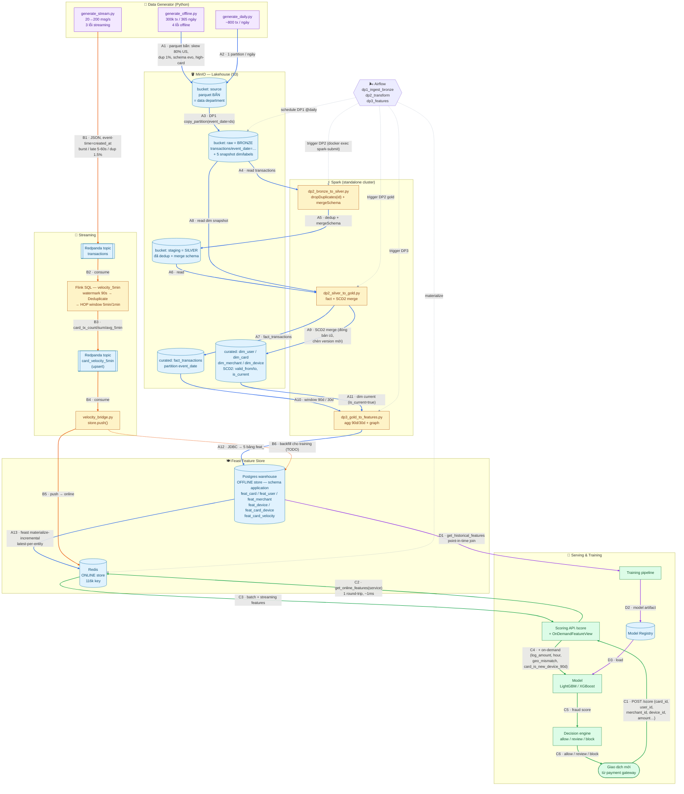
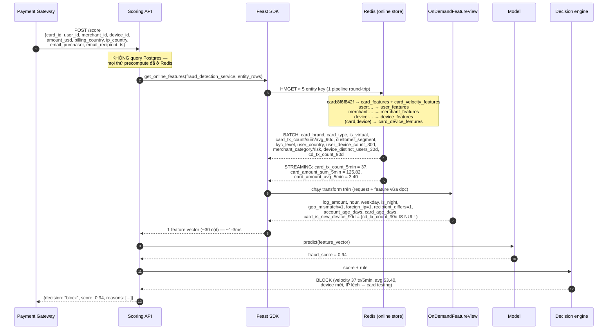
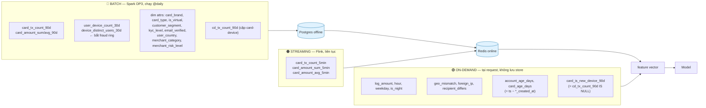

# Fraud Detection — Data Platform Flow

4 luồng, mỗi luồng đánh số và tô màu riêng:

| Màu | Luồng | Ý nghĩa |
|---|---|---|
| 🔵 xanh dương | **A1–A13** | Batch: generator → medallion → offline feature store → online |
| 🟠 cam | **B1–B6** | Streaming: producer → Kafka → Flink → online store |
| 🟢 xanh lá | **C1–C6** | Serving: request `/score` → feature → model → quyết định |
| 🟣 tím | **D1–D3** | Training: point-in-time join → model registry |
| ⚫ xám đứt | — | Control: Airflow điều phối (không truyền dữ liệu) |

## 1. Toàn cảnh hệ thống

## 2. Chi tiết: một request `/score` đi như thế nào

## 3. Ba tầng feature — ai tính, tính ở đâu

## Ghi chú kỹ thuật

- **Airflow → Spark**: `docker exec spark-master spark-submit` (mount `/var/run/docker.sock` + `group_add: 984`). Phương án prod nên đổi sang Spark Connect / spark-on-k8s.
- **Watermark 90s**: đánh đổi *freshness ↔ completeness*. Watermark lớn bắt được nhiều hàng muộn nhưng feature ra chậm → vô dụng cho fraud real-time. Producer trễ tối đa 60s nên 90s là đủ.
- **`feat_card_velocity` (B6) hiện rỗng**: velocity mới chỉ đi vào online store. Muốn train với velocity phải backfill lịch sử vào bảng này.
- **Point-in-time (D1)**: SCD2 `valid_from_ts/valid_to_ts` + `event_timestamp` của bảng `feat_` cho phép lấy đúng giá trị *tại thời điểm* giao dịch → chống data leakage.
