# Fraud Detection — Idea & Proof

## The Idea

**Real-time fraud scoring for card transactions.** A client sends a transaction to `POST /score`, the system returns a fraud probability + decision (block/allow) within a few hundred ms, and the whole model lifecycle (data → features → train → deploy → monitor → retrain) runs as a closed loop on GKE.

```
                 ┌──────────────── batch, daily ────────────────────┐
Postgres (transactions) ─► Airflow: build features (SQL) ─► Feast ─► Redis (online store)
                                                                        │
Client ── POST /score ──► FastAPI (src/fraud_detection/core)            │
                            │ 1. read historical features from Feast ◄──┘
                            │ 2. real-time 1h/24h velocity (Redis Lua)
                            │ 3. assemble 24-feature vector
                            ▼
                          KServe — LightGBM (canary 80/20)
                            │   returns probability + true model_version
                            ▼
                          probability ≥ 0.8 → block, otherwise allow
                            │
                            └─► Kafka "predictions" ─► prediction-writer (KEDA 0↔2)
                                        └─► Postgres: transactions + prediction_logs
                                                │
                              Grafana / drift / A-B dashboard ◄─┘─► retrain (MLflow → KServe)
```

The key design decisions:

1. **Two kinds of features.** Historical features (account age, amount z-score, 24h stats, …) are precomputed daily by Airflow using SQL window functions (point-in-time, no leakage) and materialized into Redis via Feast. Hot velocity features (a card/user's transaction count over 1h/24h) are computed at request time by 2 Lua scripts on Redis — the thing a batch pipeline can never keep fresh.
2. **Model separated from the API.** LightGBM is served by KServe (MLServer, V2 protocol) and autoscaled by Knative. The API only assembles the vector and makes an HTTP call — deploying a new model never touches the API.
3. **The hot path never waits for logging.** Results are pushed to Kafka; the `prediction-writer` worker (KEDA scales on lag, 0↔2 replicas) writes them to Postgres. That same data feeds retraining, drift detection and A/B analysis — the loop closes itself.
4. **A model release is just a number change in Helm.** KServe canary split divides traffic 80/20 between two revisions; the model declares its own `model_version` in the inference response, so logs always record the version that actually scored the request. Promote/rollback is a single `helm upgrade`.

---

## Proof — every piece ran for real

### 1. Data generator

[`scripts/initial/generate_fake_data.py`](../scripts/initial/generate_fake_data.py) generates ~300k transactions into 6 Postgres tables (`users/cards/merchants/devices/transactions/labels`). Fraud is generated as **episodes** (card testing, account takeover, bust-out, fraud ring) rather than per-row dice rolls, with ~10% label noise — so the signal lives in behavioral sequences and is genuinely hard to learn. There is also [`scripts/simulate_drift.py`](../scripts/simulate_drift.py) to inject/revert deliberate drift (configuration shown below).

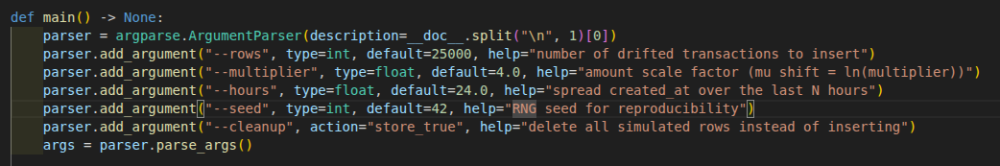

The training dataset is produced by joining `transaction_features` with `labels` in Postgres:

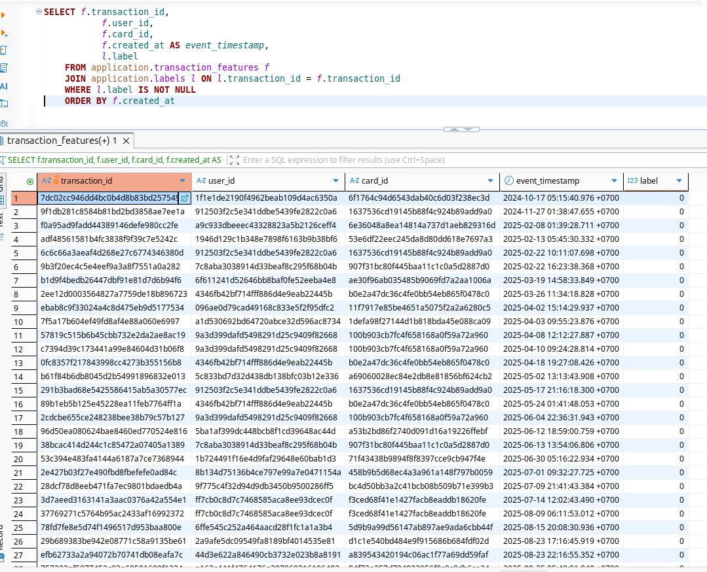

### 2. Feature pipeline & Feature store

The `feature_pipeline` DAG (Airflow, daily): `check_source → build_features → validate_output → materialize_incremental`. Features are computed entirely inside Postgres, only rows in the run's window are inserted (idempotent), then Feast materializes incrementally into Redis.

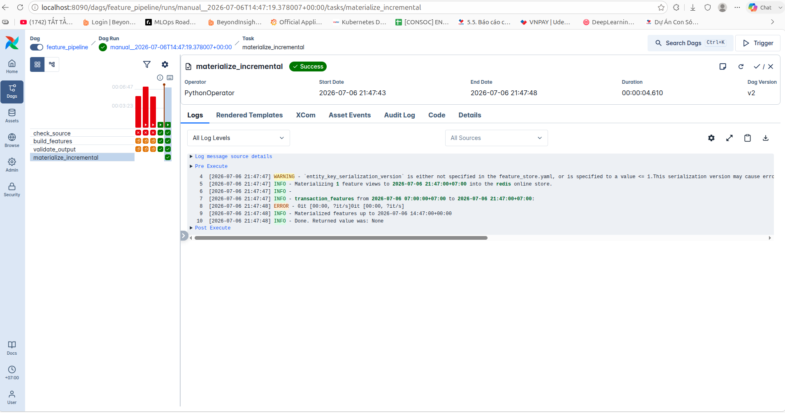
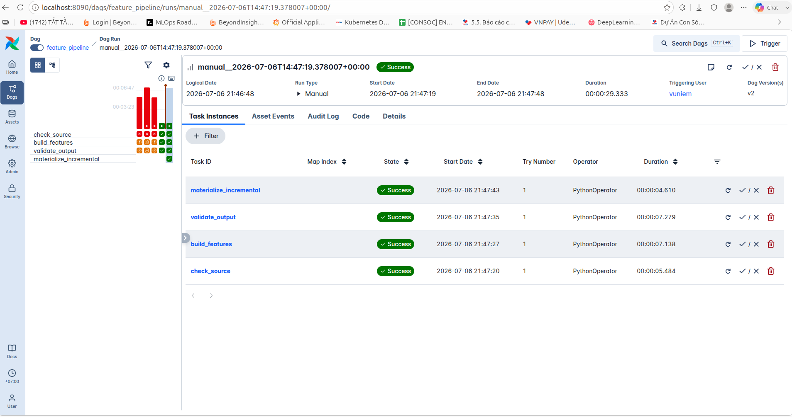

The streaming path into the offline store: `prediction-writer` consumes Kafka and writes each transaction + prediction log to Postgres (pod logs on GKE):

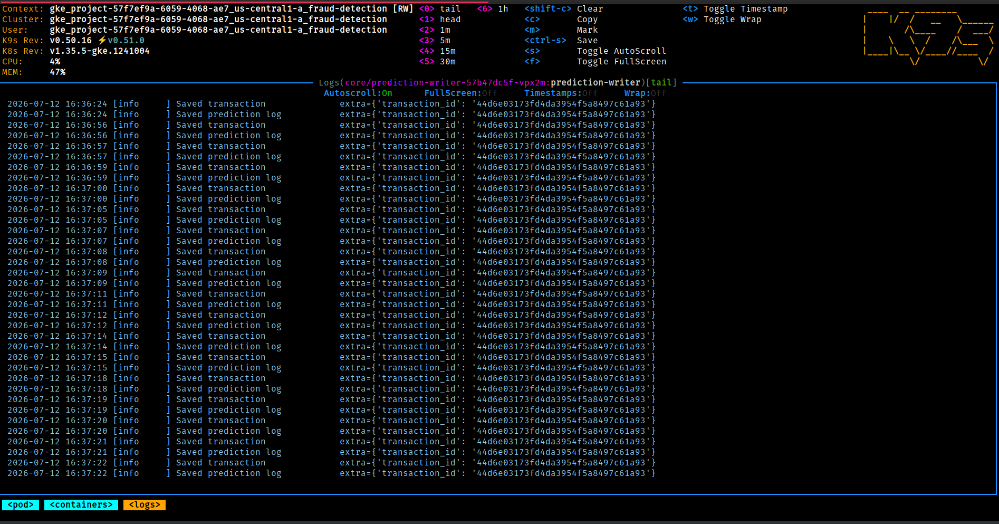

### 3. Versioning (DVC + MLflow)

The dataset is versioned with DVC, artifacts pushed to GCS (`fraud-detection-dvc`); the model + params + metrics + dataset hash are tracked in MLflow, registered model `fraud-detection-lightgbm` v1. The dataset hash in the MLflow run (`d33360d8…`) matches the exact file on GCS (`md5/d3/3360d8…`) — which dataset trained which model is fully traceable.

Model results: **val ROC-AUC 0.94, PR-AUC 0.845** (190k train / 47.5k val).

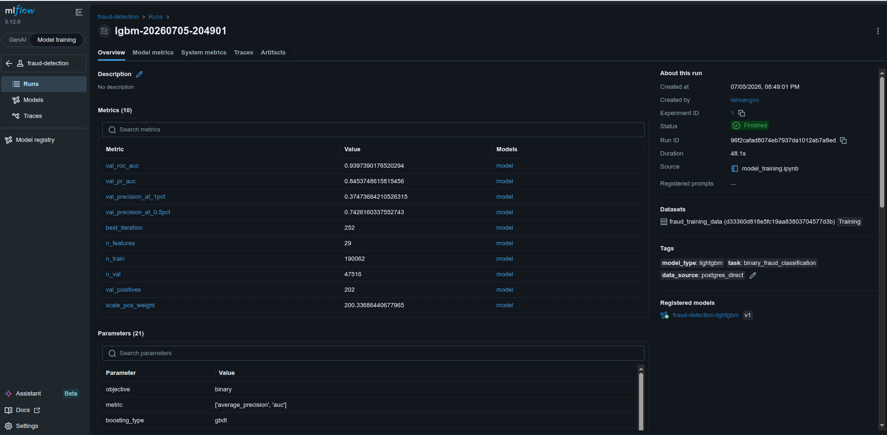
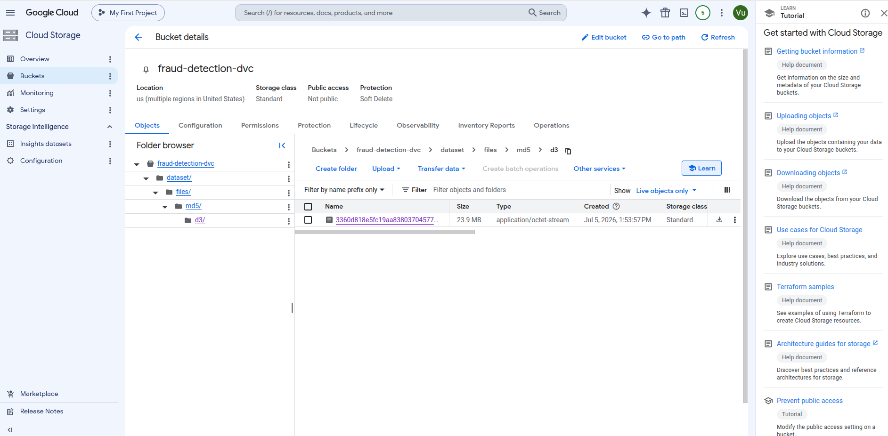

### 4. Validation & Verification

168 tests / 100% coverage, EP-BVA, mutation testing with 32/32 mutants killed, property-based testing, and a load test against the real deployed service meeting all SLAs (0% errors, p95 320ms). Details: [validation_verification.md](validation_verification/validation_verification.md).

### 5. Serving & Routing gateway

Everything is exposed through NGINX Ingress (LoadBalancer) with sslip.io domains: the API sits behind **basic auth + a 10 RPS rate limit**, Grafana gets its own domain. Internally the API calls KServe; the DB goes through Cloud SQL Proxy + Workload Identity.

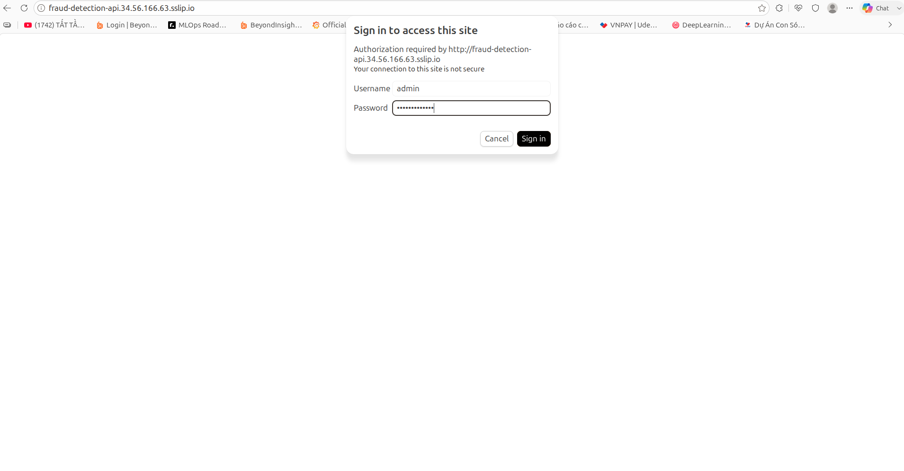
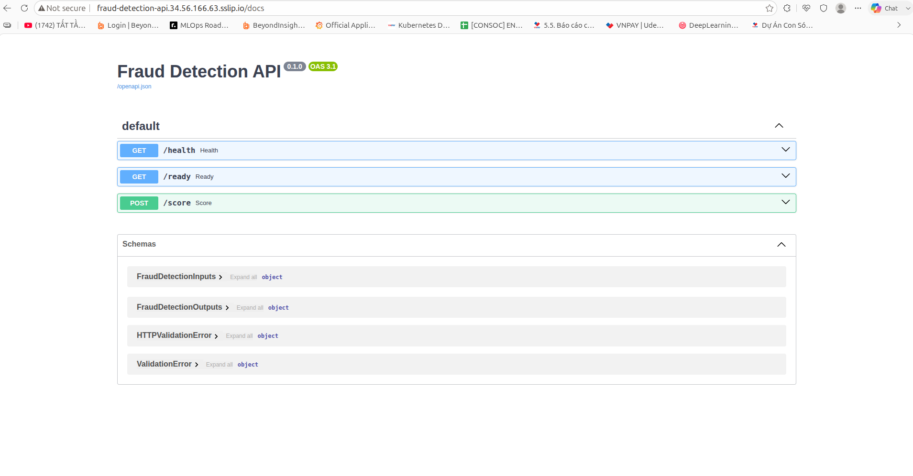
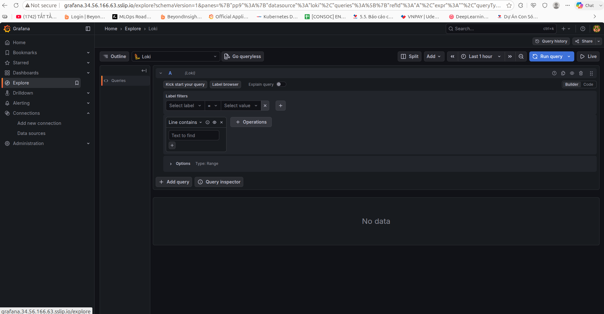

### 6. A/B Testing

Two model versions run side by side via KServe canary (`canary.trafficPercent: 20`), and each request hits exactly one revision. `model_version` is taken from the inference response (not an env var), so the **A/B Model Monitoring** dashboard splits requests / traffic share / fraud predictions / latency by the version that actually served each request (`96f2cafa` vs `b54d24fe` — the screenshot was taken under low traffic, hence the displayed 67/33 ratio):

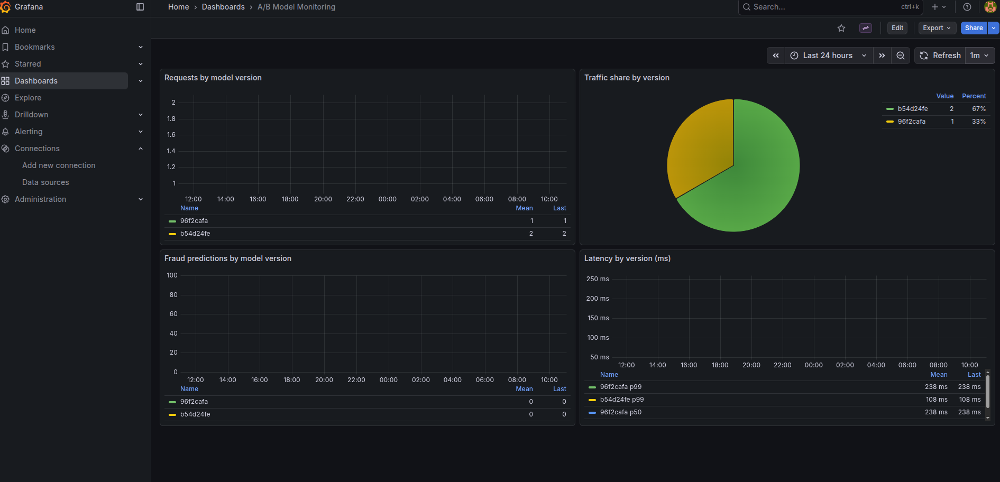

### 7. Clean Code & Design Patterns

The repo has a strict separation of roles (`src/tests/infra/docs/scripts/proof`, data goes through DVC and never enters git), the code carries docstrings + type hints throughout, and 8 design patterns are genuinely in use (Template Method, Factory Method, Repository, Facade, DI, Adapter, DTO, Context Manager) — each with file:line evidence and screenshots in [clean_code.md](clean_code/clean_code.md).

### 8. Drift Detection

The `drift-detection` service (internal, `/detect`) compares the last 30 days of `amount_usd` in Postgres against the training baseline using the **log-scale Wasserstein distance**, threshold 0.1. Demo: inject 25k transactions with amounts ×4 via `simulate_drift.py` → the dashboard flips to **DRIFT DETECTED**, wasserstein = 0.133 over 237k samples (then `--cleanup` restores the DB to its previous state):

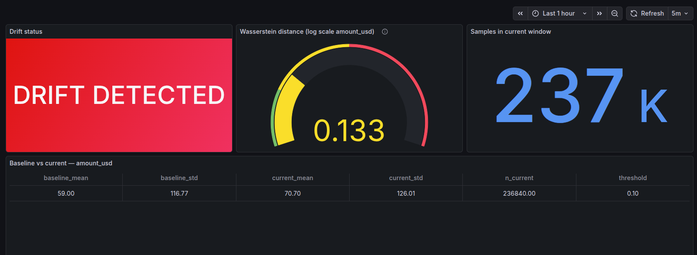
