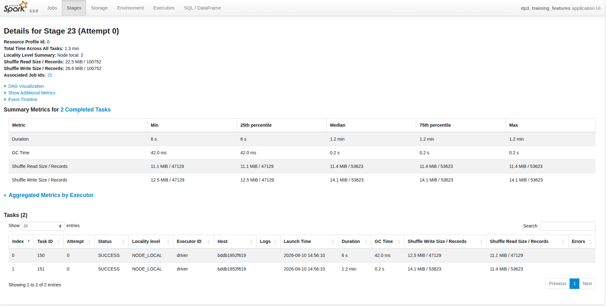

# Tối ưu skew `merchant_id` trong `dp3_training_features`

Dữ liệu: 100,752 giao dịch / 124 ngày. VM e2-standard-4, `spark-submit --master local[2]`.

## Vấn đề

`merchant_distinct_cards_30d` viết bằng `size(collect_set(card_id).over(rangeBetween(-30d, 0)))`.
Frame trượt của Spark không có buffer tăng dần — mỗi dòng dựng lại tập hợp từ đầu cửa sổ, nên
chi phí **bậc hai theo số dòng của một merchant**. Mà `merchant_id` lệch 1,542x: một merchant
ôm 24,675 dòng = 24,5% toàn bảng, và mọi dòng cùng merchant bắt buộc nằm trên một task.

Chữ ký của loại skew này — stage cửa sổ `merchant_id`, trước tối ưu:

| | task 0 | task 1 | lệch |
|---|---|---|---|
| Duration | 6,4 s | **71,7 s** | **11,2x** |
| CPU | 5,5 s | 70,8 s | 12,9x |
| Shuffle Read | 11,09 MiB | 11,40 MiB | **1,03x** |
| GC / Spill | 0 | 0,2 s / 0 | — |

Hai task nhận bằng nhau về byte nhưng lệch 11 lần về thời gian. **Đừng chẩn đoán cửa sổ này
bằng Shuffle Read** — chi phí tỉ lệ với bình phương số dòng mỗi khoá, không tỉ lệ với byte.

## Thay đổi

Đổi câu hỏi: thay vì "tại t có bao nhiêu card khác nhau trong `[t-30d, t]`", hỏi ngược — mỗi
lần xuất hiện của một card phủ **một khoảng** trên trục t, rồi đếm khoảng phủ điểm t bằng chuỗi
cộng dồn (frame tăng dần → tuyến tính). Cài đặt: [`shared/spark_windows.py`](../shared/spark_windows.py).

## Kết quả

| | trước | sau | |
|---|---|---|---|
| Stage cửa sổ `merchant_id` | 78,0 s | 32,5 s | −58% |
| ↳ task chậm nhất | 71,7 s | 29,5 s | −59% |
| Cả job — wall | 136,7 s | 112,4 s | −18% |
| Cả job — executor | 166,4 s | 149,8 s | −10% |

App ID: `local-1786348513540` (trước) · `local-1786349805126` (sau).

Skew **không biến mất** — một khoá thì không tách được, `adaptive.skewJoin` chỉ cứu JOIN. Thứ
đổi là độ dốc: bậc hai → tuyến tính.

## Phần phải trả

Helper thêm 4 shuffle (9,3 s) và một lượt quét parquet nữa (19,4 s). Tiết kiệm 45,5 s ở stage
nóng, trả lại 28,7 s → ròng −16,6 s. Vì vậy tỉ lệ của cả job (−10%) nhỏ hơn nhiều tỉ lệ của
riêng stage được sửa (−58%).

29,5 s còn lại ở task nóng **không còn là `collect_set`** mà là `count`/`avg`/`stddev` trên cùng
`merch_30` — nhiều khả năng cũng bậc hai vì cùng cơ chế frame trượt. *Giả thuyết, chưa đo.*

## Chưa đóng

⚠️ Bản cài đặt PySpark **chưa được đối chiếu với `collect_set` trên dữ liệu thật**. Bước B3 của
`skew_probe.py --source gold` so từng dòng trên đủ 100,752 giao dịch, và cũng trả lời luôn giả
thuyết ở trên (mốc B0). Chạy xong thì cập nhật mục này.

Lưu ý khi tái lập: `curated/fact_transactions` chỉ có những ngày DAG đã chạy. Không backfill
bằng `dp2_silver_to_gold.py --stage fact --date all` trước thì dp3 chỉ đọc 814 dòng và không
có skew nào để thấy.

## Ảnh

**Trước** — Duration 6 s vs 1,2 phút, trong khi Shuffle Read 11,1 vs 11,4 MiB:

**Sau** — cùng stage, cùng số dòng mỗi task (47,129 / 53,623): 3 s vs 30 s.

