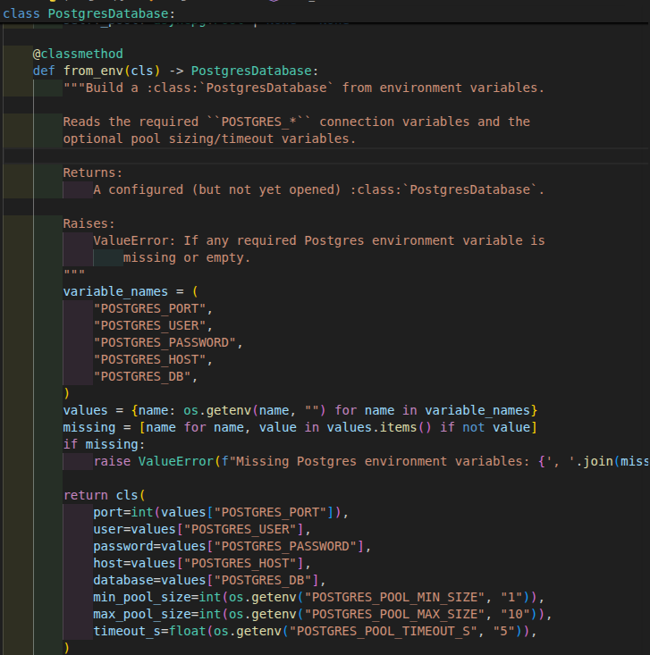
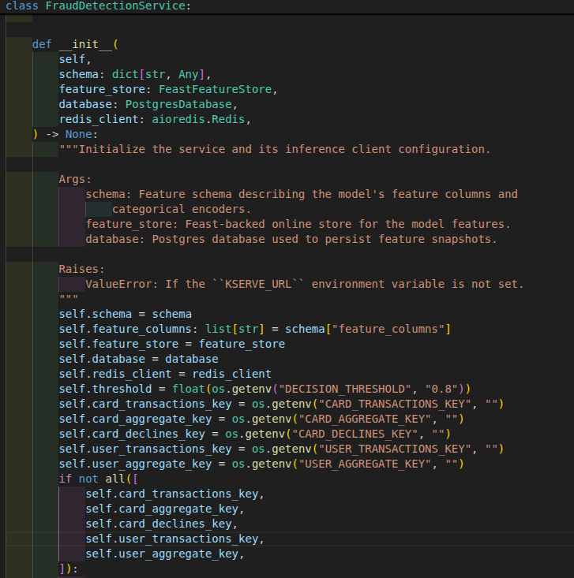
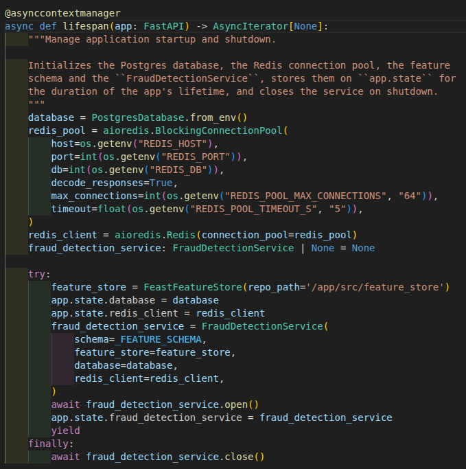
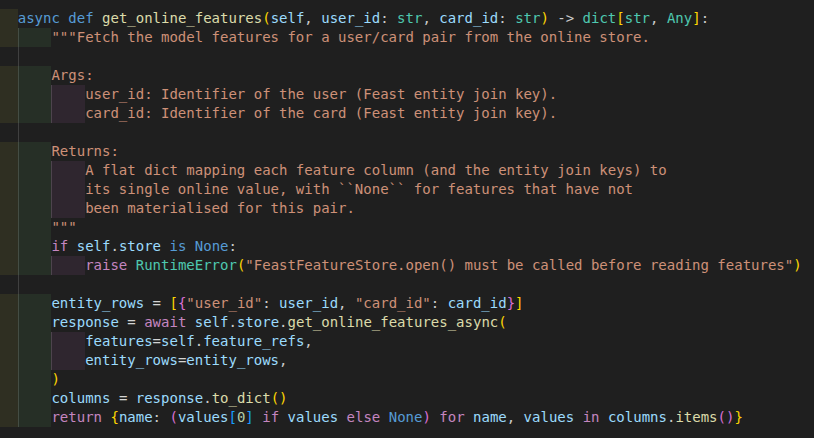
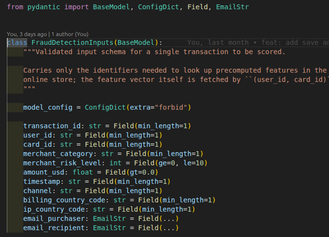
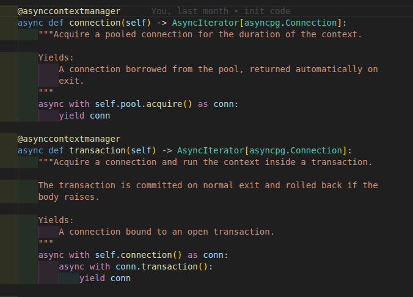

# Clean Code, Clean Repo & Design Patterns

Every claim below points to **real code in this repo** (exact file + line), not illustrative snippets. Screenshots live next to this file in `proof/clean_code/`.

---

## 1. Clean Repo

The repo tracks **288 files**, each directory has exactly one role, and no artifacts leak into git:

```
fraud-detection/
├── src/                              # production code, split by domain
│   ├── fraud_detection/core/         #   scoring API: api.py, predict.py, feature_store.py, models.py, utils.py
│   ├── drift_detection/              #   drift API: main.py, service.py, repository.py, detector.py, schemas.py
│   ├── workers/                      #   Kafka consumers: base_worker.py + postgres/postgres_worker.py
│   ├── database/                     #   asyncpg connection-pool wrapper (postgres.py)
│   └── feature_store/                #   Feast repo: entities, feature views/services, feature_store.yaml
├── tests/                            # unit, EP-BVA, property-based, locust — kept out of src/
├── airflow/                          # feature pipeline: DAG + SQL ETL + Feast repo, dockerized
├── infra/
│   ├── docker/                       # one Dockerfile per service
│   └── k8s/helm/                     # one Helm chart per service (serving, grafana, prometheus, loki, …)
├── docs/                             # one deploy guide per service
├── scripts/                          # one-off tools: generate data, simulate drift, load test
├── proof/                            # evidence for each rubric item
├── models/                           # model artifact + feature schema + model-settings.json
├── dataset/                          # DVC pointers only — real parquet lives on GCS
├── pyproject.toml / uv.lock          # deps + pytest/coverage/mutmut config in one place
└── README.md
```

The most important property: **data and artifacts never enter git**. [`.gitignore`](../../.gitignore) ignores `dataset/*` but keeps the `.dvc` pointers; `mutants/`, `__pycache__/`, `certs/` and coverage output are all blocked:

```gitignore
# DVC-tracked datasets: ignore the data files, but keep the .dvc pointers and
# DVC's own .gitignore under version control.
dataset/*
!dataset/*.dvc
!dataset/.gitignore
```

## 2. Clean Code

The most objective evidence is **measurable**, and it is already in [validation_verification.md](../validation_verification/validation_verification.md): 168 tests / **100% coverage** (branch coverage on, 90% gate), mutation testing with **32/32 mutants killed**, property-based tests for invariants. Code this testable cannot be dirty — 100% coverage is only reachable because every dependency is injected and therefore mockable (see the DI pattern below).

Consistent habits across **every** module:

- **Google-style docstrings** (Args/Returns/Raises) on every module, class and method — e.g. [base_worker.py:154-176](../../src/workers/base_worker.py#L154-L176).
- **Full type hints**, including compound return types: `async def predict_with_kserve(self, vector: list[float]) -> tuple[float, str]` ([predict.py:252](../../src/fraud_detection/core/predict.py#L252)).
- **Custom exceptions that carry context** instead of generic raises: `InsufficientDataError(found, required)` ([service.py:25-33](../../src/drift_detection/service.py#L25-L33)).
- **Named constants with rationale**: `WD_THRESHOLD_LOW / WD_THRESHOLD_HIGH` with the threshold table right at the top of the file ([detector.py:19-24](../../src/drift_detection/detector.py#L19-L24)).
- **Structured logging** (structlog with `extra={...}` fields) and **idempotent operations** (`open()`/`close()` safe to call twice, inserts with `ON CONFLICT DO NOTHING`).
- Small, single-responsibility files: the whole `src/` tree is under 1,700 lines, the largest file (`predict.py`) is 544 lines, most are < 200.

## 3. Design Patterns

Patterns **actually in use** in the code:

| # | Pattern | Where | What it solves |
|---|---|---|---|
| 1 | Template Method | `workers/base_worker.py` + `workers/postgres/postgres_worker.py` | Kafka consume loop written once; a new worker only implements `handle()` |
| 2 | Factory Method | `database/postgres.py` — `PostgresDatabase.from_env()` | Keeps env-based construction logic out of the constructor |
| 3 | Repository | `drift_detection/repository.py` | Isolates SQL from business logic |
| 4 | Facade (Service Layer) | `fraud_detection/core/predict.py` — `FraudDetectionService` | One front for 5 systems: Postgres, Feast, Redis, KServe, Kafka |
| 5 | Dependency Injection | `core/api.py`, `drift_detection/main.py` | Object graph assembled in lifespan, endpoints receive it via `Depends` → 100% mockable |
| 6 | Adapter | `core/feature_store.py` — `FeastFeatureStore` | Hides the Feast SDK behind a small async interface |
| 7 | DTO (Pydantic) | `core/models.py`, `drift_detection/schemas.py` | Immutable request/response contract, `extra="forbid"` |
| 8 | Context Manager | `database/postgres.py` — `connection()` / `transaction()` | Borrow/return connections and commit/rollback automatically |

### 3.1. Template Method

The base class owns the **algorithm skeleton** `start → consume_loop → process_one → handle`, where `handle` is a hook that raises `NotImplementedError` ([base_worker.py:178-187](../../src/workers/base_worker.py#L178-L187)); the `PredictionWriter` subclass only overrides `handle` to write to Postgres ([postgres_worker.py:71](../../src/workers/postgres/postgres_worker.py#L71)) and extends `start` to open/close the pool around `super().start()` ([postgres_worker.py:57-69](../../src/workers/postgres/postgres_worker.py#L57-L69)).

### 3.2. Factory Method

`PostgresDatabase.from_env()` is a classmethod factory: it reads the environment, raises if any variable is missing, and only then calls `cls(...)` ([postgres.py:57-92](../../src/database/postgres.py#L57-L92)). All three places that construct a database in the repo go through this factory ([postgres_worker.py:186](../../src/workers/postgres/postgres_worker.py#L186), [drift main.py:40](../../src/drift_detection/main.py#L40)).



### 3.3. Repository

All SQL of the drift service lives in one 27-line file ([repository.py](../../src/drift_detection/repository.py)); the service just calls `fetch_amounts_last_30_days(conn)` ([service.py:101-102](../../src/drift_detection/service.py#L101-L102)) — changing the query never touches business logic, and testing the service only requires faking one function.

### 3.4. Facade / Service Layer

`FraudDetectionService` ([predict.py:104](../../src/fraud_detection/core/predict.py#L104)) holds 5 long-lived clients (Postgres, Feast, Redis + 2 Lua scripts, KServe HTTP, Kafka producer) behind **one** method, `predict()` ([predict.py:339](../../src/fraud_detection/core/predict.py#L339)); the `/score` endpoint knows nothing about those 5 systems — it only calls `service.predict(inputs)`.



### 3.5. Dependency Injection

Two layers: (1) every service/worker receives its dependencies **through the constructor**, never `new`-ing them internally — the object graph is assembled in the lifespan ([api.py:41-71](../../src/fraud_detection/core/api.py#L41-L71)); (2) endpoints obtain the service via `Depends(get_fraud_detection_service)` ([api.py:83-85](../../src/fraud_detection/core/api.py#L83-L85), [api.py:117](../../src/fraud_detection/core/api.py#L117)). This is exactly why the test suite can mock Postgres/Redis/Feast/KServe/Kafka and reach 100% coverage.



### 3.6. Adapter

`FeastFeatureStore` ([feature_store.py:36-108](../../src/fraud_detection/core/feature_store.py#L36-L108)) wraps the Feast SDK behind a 3-method interface (`open / get_online_features / close`): the domain receives a flat `dict` and imports nothing from Feast; swapping Feast for another store means rewriting only this adapter. Likewise, `PostgresDatabase` wraps the asyncpg pool.



### 3.7. DTO / Schema

`FraudDetectionInputs` ([models.py:12-33](../../src/fraud_detection/core/models.py#L12-L33)): `extra="forbid"` plus per-field constraints (`gt=0`, `ge=0, le=10`, `EmailStr`) — invalid requests are rejected at the boundary with a 422, so the service never sees dirty data (these exact constraints are what the EP-BVA tests in the validation proof exercise).



### 3.8. Context Manager

`connection()` / `transaction()` ([postgres.py:137-160](../../src/database/postgres.py#L137-L160)): borrow a connection from the pool and return it automatically on exiting `async with`; the `transaction()` variant adds automatic commit/rollback — a caller cannot forget to return a connection.


