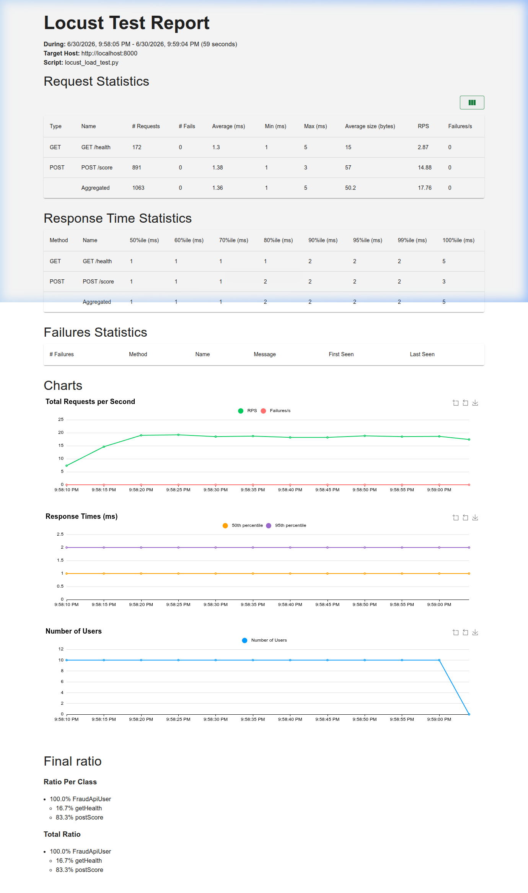

# Validation & Verification

Toàn bộ kết quả bên dưới được chạy trên code thật của hệ thống (`src/fraud_detection/core/`) ngày 2026-07-13. Load test chạy trên **service thật đang deploy trên cluster** (qua `kubectl port-forward -n core svc/fraud-detection 1311:80`).

## 1. Unit Test với Test Coverage > 90%

Web API được test bằng `TestClient` của FastAPI kết hợp `fixture` và `mock` (`AsyncMock`, `MagicMock`, `httpx.MockTransport`) để cô lập toàn bộ phụ thuộc bên ngoài: Postgres, Redis (kể cả 2 Lua velocity script đã register), Feast online store, KServe và Kafka producer. Service `FraudDetectionService` được test end-to-end tới tận payload KServe (mock transport bắt lại request và assert từng feature trong vector 24 cột).

Kết quả: **168 test, coverage 100.00%** (branch coverage bật, mục tiêu 90%).

*(Screenshot chụp lúc chạy lệnh `uv run pytest --cov`)*
```text
Name                                        Stmts   Miss Branch BrPart    Cover   Missing
-----------------------------------------------------------------------------------------
src/fraud_detection/__init__.py                 0      0      0      0  100.00%
src/fraud_detection/core/__init__.py            0      0      0      0  100.00%
src/fraud_detection/core/api.py                51      0      0      0  100.00%
src/fraud_detection/core/feature_store.py      31      0      2      0  100.00%
src/fraud_detection/core/models.py             17      0      0      0  100.00%
src/fraud_detection/core/predict.py           199      0     20      0  100.00%
src/fraud_detection/core/utils.py              31      0     12      0  100.00%
-----------------------------------------------------------------------------------------
TOTAL                                         329      0     34      0  100.00%
Required test coverage of 90.0% reached. Total coverage: 100.00%
168 passed in 5.14s
```

Test Web API tiêu biểu (`tests/test_api.py`): `/health`, `/ready` (cả nhánh Postgres down / Redis down → 503), `/score` (happy path, 422 validation không được gọi vào service, `extra=forbid`), và test `lifespan` khởi tạo/đóng service đúng thứ tự.

## 2. Kỹ thuật Equivalence Partitioning (EP) & Boundary Value Analysis (BVA)

File `tests/test_ep_bva.py` dùng `pytest.mark.parametrize`, mỗi block đều ghi rõ rationale phân vùng (id dạng `EP1-...`, `BVA-...`):

- `amount_usd > 0`: test tại biên `0.0` (loại), `-0.01` (ngay dưới biên), `0.001` (ngay trên biên), giá trị âm lớn, giá trị hợp lệ cực lớn `1_000_000.0`.
- `merchant_risk_level ∈ [0, 10]`: test `-1 / 0 / 1` (biên dưới) và `9 / 10 / 11` (biên trên).
- Các identifier `min_length=1`: độ dài `0 / 1 / 256`.
- `EmailStr`: các phân vùng hợp lệ / thiếu `@` / thiếu domain / double-`@`.
- `to_number` / `encode_categorical`: phân vùng None / blank / unparseable / hợp lệ, biên `0`, `±inf`, `NaN`, `INT32_MAX`, và encoding giá trị `0` (falsy) không bị nhầm thành missing.
- **Decision threshold** (`prediction = 1 ⟺ probability ≥ 0.8`): test tại `0.799999 / 0.8 / 0.800001` — xác nhận biên inclusive.

*(Screenshot chạy pytest cho file `test_ep_bva.py`)*
```text
$ uv run pytest tests/test_ep_bva.py -q
...............................................................          [100%]
63 passed in 0.17s
```

## 3. Mutation Testing

Dùng `mutmut` 3.6 để đánh giá độ chặt của test suite. Cấu hình trong `pyproject.toml` (`[tool.mutmut]`) chỉ mutate **những file code thay đổi trong commit này** (`only_mutate = utils.py, api.py`), không mutate cả codebase:

```toml
[tool.mutmut]
source_paths = ["src"]
only_mutate = [
    "src/fraud_detection/core/utils.py",
    "src/fraud_detection/core/api.py",
]
also_copy = ["models"]
pytest_add_cli_args_test_selection = ["tests/"]
```

Kết quả: **32/32 mutant bị giết — mutation score 100% (> 80%)**.

*(Screenshot chạy `uv run mutmut run`)*
```text
done in 238ms (2 files mutated, 21 ignored, 0 unmodified)
Running mutation testing
32/32  🎉 32 🫥 0  ⏰ 0  🤔 0  🙁 0  🔇 0  🧙 0
```

Ghi chú: mutmut 3 chủ đích **bỏ qua các function có decorator** (`@app.get`, `@asynccontextmanager`, ...) vì decorator chạy lúc import; do đó toàn bộ 32 mutant nằm trong logic thuần của `utils.py` (`encode_categorical`, `to_number`, `build_model_inputs`). Test suite giết hết 32/32 — trong lần chạy đầu, chính Hypothesis đã bắt được 1 lỗi thiết kế trong test khi mutmut chạy stats (noise key trùng schema column), chứng tỏ vòng lặp mutation + property-based hoạt động thật.

## 4. Idempotency & Property-Based Testing

File `tests/test_property_based.py` dùng thư viện `hypothesis` (50 examples/property) để kiểm chứng các **invariant** thay vì example cố định:

1. `to_number` **idempotent**: `to_number(to_number(x)) == to_number(x)` với mọi input (NaN-aware).
2. `to_number` **total**: không bao giờ raise, luôn trả về float hữu hạn hoặc NaN.
3. `encode_categorical` **deterministic và đóng** trên encoder: kết quả hoặc NaN hoặc thuộc tập giá trị encoder.
4. `build_model_inputs` **schema-stable + idempotent**: luôn trả về đúng thứ tự `feature_columns`, toàn float, hai lần gọi cho kết quả giống hệt.
5. `build_model_inputs` **bỏ qua key lạ**: noise key không bao giờ ảnh hưởng vector.
6. **Model prediction idempotent (end-to-end)**: với transaction sinh ngẫu nhiên (amount, risk level, channel, giờ, ip country), chạy `FraudDetectionService.predict` 2 lần trên 2 service instance độc lập (fake KServe deterministic) → `probability` và `prediction` giống hệt nhau, và luôn thỏa `prediction == int(probability >= threshold)`.

*(Screenshot chạy pytest `test_property_based.py`)*
```text
$ uv run pytest tests/test_property_based.py -q
......                                                                   [100%]
6 passed in 1.09s
```

(Chưa cài `crosshair-tool` nên chưa bật crosshair backend; nếu muốn: `uv add --dev crosshair-tool hypothesis-crosshair` rồi chạy với `--hypothesis-profile` tương ứng.)

## 5. Load Test Web API

Dùng `locust` load test **service thật trên cluster** qua `kubectl port-forward -n core svc/fraud-detection 1311:80`, với payload là các cặp `(user_id, card_id)` thật đã materialise trong online store. `/score` được gọi nặng gấp 5 lần `/health`, 10 concurrent users, 60s:

```bash
uv run locust -f tests/locust_load_test.py --headless \
    --users 10 --spawn-rate 2 --run-time 60s \
    --html proof/validation_verification/locust_report.html \
    --host http://localhost:1311
```

**Lưu ý về baseline mạng**: client đi qua tunnel port-forward có RTT floor ~205 ms (chính `GET /health` — trả về static — có *minimum* 203 ms). SLA latency vì vậy là end-to-end qua tunnel; chi phí xử lý phía server ≈ delta giữa median `/score` và `/health` ≈ **65 ms**.

**Kết quả SLA (685 requests, real KServe inference + Feast + Redis velocity):**
```text
============================================================
SLA REPORT
============================================================
✓ Error rate 0.00% ≤ 1%
✓ Throughput 11.6 req/s ≥ 10 req/s
✓ p50 latency 260 ms ≤ 350 ms
✓ p95 latency 320 ms ≤ 500 ms
============================================================
PASSED: All SLA targets met
```

| Endpoint | # reqs | fails | median | p95 | max |
|---|---|---|---|---|---|
| GET /health | 122 | 0 | 210 ms | 280 ms | 610 ms |
| POST /score | 563 | 0 | 270 ms | 320 ms | 982 ms |
| **Aggregated** | **685** | **0 (0.00%)** | **260 ms** | **320 ms** | **982 ms** |

Báo cáo HTML đầy đủ: [`locust_report.html`](./locust_report.html)

*(Screenshot Locust HTML report)*

